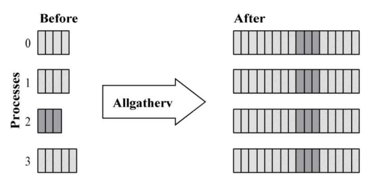
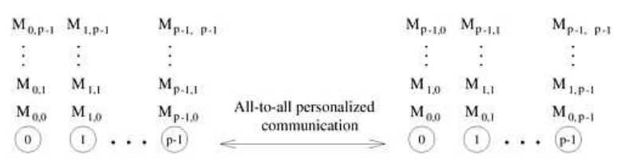
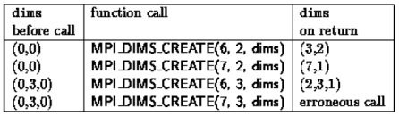

# MPI

[TOC]

## **$1 概述**

> 参考老师PPT，加粗部分即为重点内容。

**MPI是一个跨语言（编程语言如C, Fortran等）的通讯协议**，用于编写并行计算机。支持点对点和广播。MPI是一个**信息传递应用程序接口**，包括**协议和和语义说明**，他们指明其如何在各种实现中发挥其特性。MPI的目标是高性能，大规模性，和可移植性。MPI在今天仍为高性能计算的主要模型。与OpenMP并行程序不同，MPI是一种基于信息传递的并行编程技术。**消息传递接口是一种编程接口标准，而不是一种具体的编程语言**。简而言之，MPI标准定义了一组具有可移植性的编程接口。

**Ref.：**

[MPI Tutorial Introduction - *Wes Kendall*](<https://mpitutorial.com/tutorials/mpi-introduction/>)


## **$2 MPI基本函数**

MPI调用接口的总数虽然庞大， 但根据实际编写MPI的经验， 常用的MPI调用的个数却十分有限。

下面是6个最基本的MPI函数。

1.  **MPI_Init(…);**

2.  **MPI_Comm_size(…);**

3.  **MPI_Comm_rank(…);**

4.  **MPI_Send(…);**

5.  **MPI_Recv(…);**

6.  **MPI_Finalize();**

### $2.1 `MPI_Init(int* argc, char** argv[])`

* 该函数通常应该是第一个被调用的MPI函数用于并行环境初始化，其后面的代码到 **MPI_Finalize()**函数之前的代码在每个进程中都会被执行一次。
* 除**MPI_Initialized()**外， 其余所有的MPI函数应该在其后被调用。
* MPI系统将通过argc, argv得到命令行参数（也就是说main函数必须带参数，否则会出错）。

### $2.2 `MPI_Finalize(void)`

* 退出MPI系统， **所有进程**正常退出都必须调用。 表明并行代码的结束,结束所有子进程。
* 串行代码仍可在主进程(rank = 0)上运行， 但不能再有MPI函数（包括MPI_Init()）。

### $2.3 `MPI_Comm_size(MPI_Comm comm, int* size )`

* 获得进程个数 size。
* 指定一个通信子,也指定了一组共享该空间的进程, 这些进程组成该通信子的group（组）。
* 获得通信子comm中规定的group包含的进程的数量。

### $2.4 `MPI_Comm_rank (MPI_Comm comm, int* rank)`

* 得到本进程在通信空间中的rank值,即在组中的逻辑编号(该 rank值为0到p-1间的整数,**相当于进程的ID**。

### $2.5 `MPI_Send(...)`

```cpp
int MPI_Send(void *buff, int count, MPI_Datatype datatype, 	// 消息数据
             int dest, int tag, MPI_Comm comm)				// 消息信封
```

* void *buff：发送缓冲区。
* int count：要发送的消息个数（注意：不是长度，例如你要发送一个int整数，这里就填写1，如要是发送“hello”字符串，这里就填写6（C语言中字符串未有一个结束符，需要多一位））。
* MPI_Datatype datatype：要发送的数据类型，这里需要用MPI定义的数据类型，可在网上找到，在此不再罗列。
* int dest：目的地进程号，你要发送给哪个进程，就填写目的进程的进程号。
* int tag：消息标签，接收方需要有相同的消息标签才能接收该消息。
* MPI_Comm comm：通讯域。表示你要向哪个组发送消息。

### $2.6 `MPI_Recv(...)`

```cpp
int MPI_Recv(void *buff, int count, MPI_Datatype datatype,
             int source, int tag, MPI_Comm comm,
             MPI_Status *status)
```

* void *buff：接收缓冲区。
* int count：接收数据长度的上界。具体接收到的长度可通过调用`MPI_Get_count`函数得到。
* MPI_Datatype datatype：你要接收的数据类型，这里需要用MPI定义的数据类型，可在网上找到，在此不再罗列。
* int dest：接收端进程号，你要需要哪个进程接收消息就填写接收进程的进程号。
* int tag：消息标签，需要与发送方的tag值相同的消息标签才能接收该消息。
* MPI_Comm comm：通讯域。
* MPI_Status *status：消息状态。接收函数返回时，将在这个参数指示的变量中存放实际接收消息的状态信息，包括消息的源进程标识，消息标签，包含的数据项个数等


## **$3 MPI消息数据类型**

### $3.1 定义

​		每个MPI消息都有相应的数据类型，MPI通过引入消息数据类型来解决消息传递过程中的异构性问题以及数据不连续问题。MPI的消息数据类型可以分为两种： **预定义数据类型** 和 **派生数据类型** (Derived Data Type)。

* **预定义数据类型**

  ​		预定义数据类型数据作用。MPI支持**异构计算(Heterogeneous Computing)**， 它指的是在由不同计算机组成的系统（如工作站网络）上运行应用程序。系统中的每台计算机可能由不同的厂商生产、使用不同的处理器和操作系统。一个重要的问题是，当这些计算机使用不同的数据表示时，如何保证通信双方的互操作性。MPI通过提供预定义的数据类型来解决异构计算中的互操作性问题。

* **派生数据类型**

  ​       MPI引入**派生数据类型**的概念，允许定义由数据类型不同且地址空间不连续的数据项组成的消息。

  ​       派生数据类型可以用**类型图**来描述， 这是一种通用的类型描述方法，它是一系列二元组 <基类型，偏移>的集合， 可以表示成如下格式：

  ​             { <基类型0，偏移0> ，<基类型1，偏移1>，...，<基类型n-1，偏移n-1> }

  ​       在派生数据类型中，基类型可以是**任何MPI预定义数据类型**，也可以是其他的派生数据类型，即派生数据类型支持数据类型的嵌套定义。下图给出了类型图的示意结构，其中阴影部分是基类型所占用的空间，其他部分空间可以是定义派生数据类型时特意留下的，也可以是MPI为了数据类型对齐而分配的。

### $3.2 相关构造函数

#### $3.2.1 `int MPI_Type_contiguous(...)`

```cpp
int MPI_Type_contiguous(int count,				// 块数量
                        MPI_Datatype oldtype, 	// 待复制数据类型
                        MPI_Datatype *newtype)	// 新类型
```

* 得到的新类型是将一个已有的数据类型按顺序依次连续进行复制后的结果。

#### $3.2.1 `int MPI_Type_vector(...)`

```cpp
int MPI_Type_vector(int count,					// 块数量
                    int blocklength,			// 每块所含元素个数
                    int stride, 				// 各块第一个元素之间相隔元素个数
                    MPI_Datatype oldtype, MPI_Datatype *newtype)
```

* 允许复制一个数据类型到含有相等大小块的空间，每个块通过连接相同数量的旧数据类型的拷贝来获得。块与块之间的空间是旧数据类型的extent的倍数。

* 同时，函数`MPI_Type_hvector(...)`功能相同，其中`stride`项由相隔元素个数变为**字节数**。

#### $3.2.2 `int MPI_Type_indexed(...)`

```cpp
int MPI_Type_indexed(int count, 				// 块数量
                     int array_of_blocklengths, // 每个块中所含元素个数
                     int array_of_displacements,// 各块偏移元素个数
                     MPI_Datatype oldtype, MPI_Datatype *newtype)
```

* 允许复制一个旧数据类型到一个块序列中(每个块是旧数据类型的一个连接),每个块可以包含不同的拷贝数目、具有不同的偏移，所有的块偏移都是旧数据类型extent的倍数。
* 同时，函数`MPI_Type_hindexed(...)`功能相同，其中`array_of_displacements`项由相隔元素个数变为**字节数**。

#### $3.2.3 `int MPI_Type_struct(...)`

```cpp
int MPI_Type_struct(int count, 							// 块数量
                    int *array_of_blocklengths, 		// 每个块中所含元素个数
                    MPI_Aint *array_of_displacements, 	// 偏移字节数
                    MPI_Datatype array_of_types , MPI_Datatype *newtype)
```

* 能够在上面介绍的基础上进一步允许每个块包含不同数据类型的拷贝。

#### $3.2.4 `int MPI_Type_commit(MPI_Datatype *datatype)`

```cpp
int MPI_Type_commit(MPI_Datatype *datatype)
```

* 新定义的数据类型在使用之前，必须先递交给MPI系统。
* 一个递交后的数据类型可以作为一个基本类型用在**数据类型生成器**中产生新的数据类型。
* 递交操作用于递交新定义的数据类型。
* 注意：这里的参数是指向该类型的指针，而不是定义该类型的缓冲区的内容。

#### $3.2.5 `int MPI_Type_free(MPI_Datatype *datatype)`

```cpp
int MPI_Type_free(MPI_Datatype *datatype)
```

* MPI_TYPE_FREE调用将以前已递交的数据类型释放,并且设该数据类型指针为空**MPI_DATATYPE_NULL**，由该派生类型定义的新派生类型不受当前派生类型释放的影响。


## **$4 MPI集群通信**

### $4.0 组 & 通信子

**组与上下文：**

- 进程可被分拣入各个组。
- 每条消息都是在一个**上下文(context)**内发送的，且必须在同一上下文内被接收。

**通信子：**

- 一个组以及一个上下文组成一个**通信子(communicator)**。

  即，通信子描述了**一个可互相发送消息的进程集合**，这个集合称为一个**通信域**。

- 默认通信子：`MPI_COMM_WORLD`

  默认通信子包含所有初始的进程。

- 所有MPI消息传递过程都需要通信子作为参数。

- **一个进程可以属于多个通信域。**

### $4.1 一对多通信

#### $4.1.1 `MPI_Bcast(...)`

```cpp
int MPI_Bcast(void* buffer,				// 通信缓冲区
              int count,				// 缓冲区内数据个数
              MPI_Datatype datatype,	// 缓冲区内数据类型
              int root, 				// 发送广播的根序列号
              MPI_Comm comm)			// 通信子
```

* 从一个序列号为root的进程将一条消息广播发送到组内的所有进程，**包括它本身在内**。调用时组内所有成员都使用同一个comm和root，其结果是将根的通信消息缓冲区中的消息拷贝到其他所有进程中去。

#### $4.1.2 `MPI_Scatter(...)`

```cpp
MPI_Scatter(
    void* send_data,					// 存储在0号进程的数据，array
    int send_count,						// 具体需要给每个进程发送的数据的个数
    MPI_Datatype send_datatype,			// 发送数据的类型
    void* recv_data,					// 接收缓存，缓存 recv_count个数据
    int recv_count,
    MPI_Datatype recv_datatype,
    int root,							// root进程的编号
    MPI_Comm comm)						// 通信子
```

* 将一段array 的不同部分发送给所有的进程，分发数据的时候是根据进程的编号进行的，array中的第一个元素发送给0号进程，第二个元素则发送给1号进程，以此类推。
* 通常send_count等于array的元素个数除以进程个数。

### $4.2 多对一通信

#### $4.2.1 `MPI_Gather(...)`

```cpp
MPI_Gather(
    void* send_data,					// 存储在0号进程的数据，array
    int send_count,						// 具体需要给每个进程发送的数据的个数
    MPI_Datatype send_datatype,			// 发送数据的类型
    void* recv_data,					// 接收缓存，缓存 recv_count个数据
    int recv_count,						// 从单个进程接收的数据个数，不是总数
    MPI_Datatype recv_datatype,
    int root,							// root进程的编号
    MPI_Comm comm)						// 通信子
```

* `MPI_Scatter()`的逆进程。
* 从所有的进程中将每个进程的数据集中到根进程中，同样根据进程的编号对array元素排序。

### $4.3 多对多通信

#### $4.3.1 `MPI_Allgather(...)`

```cpp
MPI_Allgather(
    void* send_data,					// 存储在0号进程的数据，arr
    int send_count,                     // 具体需要给每个进程发送的数据
    MPI_Datatype send_datatype,         // 发送数据的类型
    void* recv_data,					// 接收缓存，缓存 recv_count个数据
    int recv_count,						// 从单个进程接收的数据个数，不是总数
    MPI_Datatype recv_datatype,			
    MPI_Comm comm)						// 通信子
```

* 当数据分布在所有的进程中时，MPI_Allgather将所有的数据聚合到每个任务中。

#### $4.3.2 `MPI_Allgatherv(...)`

```cpp
MPI_Allgatherv(
    const void* sendbuf,       			// 指向发送数据的指针
    int sendcount,						// 发送数据量
    MPI_Datatype sendtype,         		// 发送数据类型
    void* recvbuf,        			    // 指向接收数据的指针
    const int recvcounts[],        		// 从各进程接收的数据量
    const int displs[],            		// 从各进程接收的数据在 recvbuf 中的偏移
    MPI_Datatype recvtype,         		// 接收数据类型
    MPI_Comm comm                  		// 通信子
);
```

* MPI_Allgatherv() ，同时具备 `MPI_Allgather()` 和 `MPI_Gatherv()` 的特点，即各进程各自拥有同一向量中**长度不相等**的各分段，要将他们全部同步为整个向量并且传送到所有任务中。

* 特点：

  * 聚合前不要求所有任务所持有的数据段长度一致。

  * 聚合后所有任务收到同一个聚合后的数据向量。

    

#### $4.3.3 `MPI_Alltoall(...)`

```cpp
MPI_Alltoall(
    void* send_data,					// 存储在0号进程的数据，arr
    int send_count,                     // 具体需要给每个进程发送的数据
    MPI_Datatype send_datatype,         // 发送数据的类型
    void* recv_data,					// 接收缓存，缓存 recv_count个数据
    int recv_count,						// 从单个进程接收的数据个数，不是总数
    MPI_Datatype recv_datatype,			
    MPI_Comm comm)						// 通信子
```

* 所有进程相互发送相同数量的数据，并从彼此接收相同数量的数据。

  

### $4.4 MPI规约函数

#### $4.4.1 `MPI_Reduce(...)`

```cpp
MPI_Reduce(
    void* send_data,					// 每个进程准备规约的数据
    void* recv_data,					// 存储规约的结果
    int count,							// 规约结果的个数
    MPI_Datatype datatype,				// 规约数据种类
    MPI_Op op,							// 规约操作
    int root,
    MPI_Comm comm)						// 通信子
```

* `MPI_Op`
  * `MPI_MAX` ——返回最大元素。
  * `MPI_MIN` ——返回最小元素。
  * `MPI_SUM` ——元素求和。
  * `MPI_PROD`——将所有元素相乘。
  * `MPI_LAND`——执行元素逻辑与。
  * `MPI_LOR` ——执行元素逻辑或。
  * `MPI_BAND` ——对元素的位进行按位与。
  * `MPI_BOR` ——对元素的位进行按位或。
  * `MPI_MAXLOC` ——返回最大值及对应的进程rank。
  * `MPI_MINLOC` ——返回最小值及对应的进程rank。
* 在每个进程上接收一组输入元素，并将一组输出元素返回到**root进程**。输出元素包含规约的结果。

#### $4.4.2 `MPI_Allreduce(...)`

```cpp
MPI_Allreduce(
    void* send_data,					// 每个进程准备规约的数据
    void* recv_data,					// 存储规约的结果
    int count,							// 规约结果的个数
    MPI_Datatype datatype,				// 规约数据种类
    MPI_Op op,							// 规约操作
    MPI_Comm comm)						// 通信子
```

* 在每个进程上接收一组输入元素，并将一组输出元素返回到**所有进程**。输出元素包含规约的结果。

#### $4.4.3 `MPI_Scan(...)`

```cpp
int MPI_Scan(
    void *sendbuf, 
    void *recvbuf, 
    int count,
    MPI_Datatype datatype, 
    MPI_Op op, 
    MPI_Comm comm)
```

* 前缀归约(或扫描归约)。与普通全归约MPI_Allreduce类似，但各进程依次得到部分归约的结果。

### $4.5 `MPI_Barrier(MPI_Comm comm)`

* 使某一进程阻塞到所有进程完成调用 。


## **$5 MPI 逻辑分划**

### $5.1 `MPI_Dims_create(...)`

```cpp
int MPI_Dims_create(
    int nodes,								// 网格中的进程数目
    int dims,								// 维度
	int *size)								// 创建的网格
```



### $5.2 `MPI_Cart_create(...)`

```cpp
int MPI_Cart_create(
    MPI_Comm old_comm,						// 原通信子
    int dims,								// 维度
	int *size,								// 网格
	int *periodic,							// 周期性：1 - 有周期性
	int reorder,							// 1 - 进程的rank可以重新赋予
    MPI_Comm *cart_comm)					// 新的通信子
```

* 有关笛卡尔拓扑的内容可以参考：

  [MPI的拓扑（虚拟拓扑和笛卡尔拓扑）](https://blog.csdn.net/qq_35571432/article/details/78441397)

  [MPI_Cart_create](http://mpi.deino.net/mpi_functions/MPI_Cart_create.html)

---

// Updating | KarlSzp | 2019/06/29
