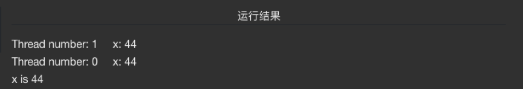
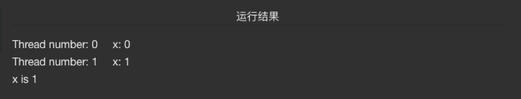
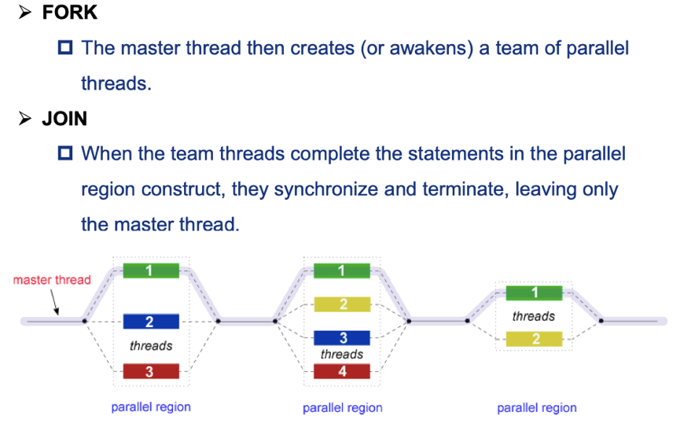

# OpenMP

[TOC]

### $1 **Brief intro.**

#### Introduction

* OpenMP是一种用于共享内存并行系统的多线程程序设计方案，支持的编程语言包括C、C++和Fortran。
* OpenMP提供了对并行算法的高层抽象描述，特别适合在多核CPU机器上的并行程序设计。
* 编译器根据程序中添加的**pragma指令**，自动将程序并行处理，使用OpenMP降低了并行编程的难度和复杂度。
* 当编译器不支持OpenMP时，程序会退化成普通（串行）程序。程序中已有的OpenMP指令不会影响程序的正常编译运行。

#### Execution Mode

* **fork-join**

  开始的时候只存在一个主线程，当需要进行并行计算的时候，派生出若干个分支线程来执行并行任务。当并行代码执行完成之后，分支线程会合，并把控制流程交给单独的主线程。

  

---

### $2 编译器指令

#### 编译器指令的目标

1. 产生一个并行区域
2. 划分线程中的代码块
3. 在线程之间分配循环迭代
4. 序列化代码段
5. 同步线程间的工作

#### 编译器指令格式

**#pragma omp 指令 [子句],[子句] …**

以#pragma omp 开始，后边跟具体的功能指令。

**常用指令**

* **parallel** 

  用在一个结构块之前，表示这段代码将被多个线程并行执行。

* **for**

  用于for循环语句之前，表示将循环计算任务分配到多个线程中并行执行，以实现任务分担，必须由编程人员**自己保证每次循环之间无数据相关性**。

* **parallel for**

  parallel和for指令的结合，也是用在for循环语句之前，表示for循环体的代码将被多个线程并行执行，它同时具有并行域的产生和任务分担两个功能。

* **sections**

  用在可被并行执行的代码段之前，用于实现多个结构块语句的任务分担，可并行执行的代码段各自用**section**指令标出（注意区分sections和section）。

* **parallel sections**

  parallel和sections两个语句的结合，类似于parallel for。

* **single**

  用在**并行域内**，表示一段只被单个线程执行的代码。

* **critical**

  用在一段代码临界区之前，保证每次只有一个OpenMP线程进入。

* **flush**

  保证各个OpenMP线程的数据影像的一致性。

* **barrier**

  用于并行域内代码的线程同步，线程执行到barrier时要停下等待，直到所有线程都执行到barrier时才继续往下执行。

* **atomic**

  用于指定一个数据操作需要原子性地完成（不可被中断）。

* **master**

  用于指定一段代码由主线程执行。

* **threadprivate**

  用于指定一个或多个变量是线程专用，后面会解释线程专有和私有的区别。

**常用子句**

* **private**

  指定一个或多个变量在每个线程中都有它自己的私有副本。

  1. 每一个线程都含有自己的私有变量副本
  2. 所有线程在for循环中不能访问最初定义的那个全局变量，它们操作的都是自己的私有副本

  > private子句可以解决私有变量的问题，一些共享变量在循环中，如果每个线程都可以访问的话，可能会出错，该子句就是为每个线程创建一个共享变量的私有副本解决循环依赖，如下所示。注private的括号中可以放置多个变量，逗号分隔。

  ```cpp
  #pragma omp  parallel for private (x)		
  for (i = 0; i <= 10;i++) {
      x = i;
      printf("Thread number: %d    x: %d\n",omp_get_thread_num(),x);
  }
  ```

* **firstprivate**

  指定一个或多个变量在每个线程都有它自己的私有副本，并且私有变量要在进入并行域或任务分担域时，继承主线程中的同名变量的值作为初值，不是每次循环迭代分配一次。

  ```cpp
  int x = 44;
  #pragma omp  parallel for firstprivate (x)
  for (i=0;i<=1;i++) {
      //x = i;
      printf("Thread number: %d  x: %d\n",omp_get_thread_num(),x);
  }
  printf("x is %d\n", x);
  ```

  

* **lastprivate**

  指定将线程中的一个或多个私有变量的值在并行处理结束后复制到主线程中的同名变量中，负责拷贝的线程是for或sections任务分担中的**最后一个线程**。

  ```cpp
  int x = 44;
  #pragma omp  parallel for lastprivate (x)
  for (i = 0;i <= 1;i++) {
      x = i;
      printf("Thread number: %d    x: %d\n",omp_get_thread_num(),x);
  }
  printf("x is %d\n", x);
  ```

  

* **reduction**

  用来指定一个或多个变量是私有的，并且在并行处理结束后这些变量要执行指定的**归约运算**，并将结果返回给主线程同名变量。

  - 规约子句

  ```C
  #pragma omp ……reduction<opreation : variable list>
  ```

  - **opreation +、-、* 、& 、| 、&& 、|| 、^** 
    将每个线程中的变量进行规约操作例如
    #pragma omp ……reduction<+ : total>就是将每个线程中的result变量的值相加，最后在所有从线程结束后，放入共享变量中，其实这也可以看作是private子句的升级版，下面的例子，最后共享的total中存入就是正确的值(浮点数数组数字之和)，其他操作符的情况可以类比得到

  ```cpp
  float total = 0.;
  
  #pragma omp parallel for reduction(+:total)
  for (size_t i = 0; i < n; i++) {
      total += a[i];
  }
  return total;
  ```

* **nowait**

  指出并发线程可以忽略其他制导指令暗含的路障同步。

* **num_threads**

  指定并行域内的线程的数目。

* **schedule**

  指定for任务分担中的任务分配调度类型。

* **shared**

  指定一个或多个变量为多个线程间的共享变量。

* **ordered**

  用来指定for任务分担域内指定代码段需要按照串行循环次序执行。

* **copyprivate**：配合single指令，将指定线程的专有变量广播到并行域内其他线程的同名变量中。

* **copyin n**

  用来指定一个threadprivate类型的变量需要用主线程同名变量进行初始化。

* **default**

  用来指定并行域内的变量的使用方式，缺省是shared。

### $3 常用函数及指令分析

#### 常用函数

- omp_get_thread_num()  获取当前线程编号
- omp_get_num_threads() 获取当前线程组的线程数量
- omp_set_num_threads() 设置线程数量

#### #pragma omp parallel

- 最基本的parallel指令，这条OpenMP指令后的一段代码将被并行化，线程数量将由系统自行决定，当然我们可以指定线程数量只需要在parallel之后加上子句限定即可，num_threads子句
- #paragm omp parallel num_threads                    (thread_count)，指定我们的并行化代码将由thread_count个线程来进行执行
- 介绍一下这个程序运行到这个子句之后的操作，首先程序本身只含有一个线程，在遇到该指令之后，原来的线程继续执行，另外的thread_count – 1个线程被启动，这thread_count个线程称为一个线程组，原始线程为主线程，额外的thread_count – 1个线程为从线程，在并行化代码块的末尾存在一个隐式路障，所有线程都到达隐式路障后从线程结束，主线程继续执行。也就是下图所示的fork-join过程



#### #pragma omp parallel for

- parallel for指令，用于并行化for循环，这个指令存在以下限制：

1. 不能并行化while等其他循环。
2. 循环变量必须在循环开始执行前就已经明确，不能为无限循环。
3. 不能存在其他循环出口，即不能存在break、exit、return等中途跳出循环的语句。

- 在程序执行到该指令时，系统分配一定数量的线程，每个线程拥有自己的循环变量，互不影响，即使在代码中循环变量被声明为共享变量，在该指令中，编译过程仍然会为每一个线程创建一个私有副本这样防止循环变量出现数据依赖，跟在这条指令之后的代码块的末尾存在隐式路障。