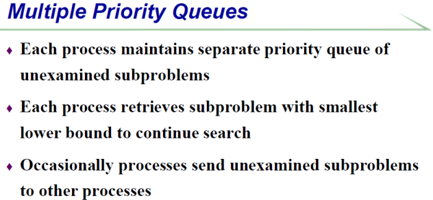
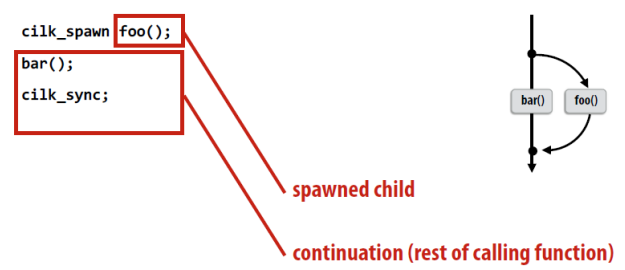

# 并行与分布式计算 考纲

[TOC]

## 题型

* 开卷
* 题型
  * 选择/判断 - 15（3 x 5）
  * 简答题 - 15（3 x 5)
  * 分析题 - 70（7 x 10）

## 提纲

### 1 - 并行计算概述

​	

1. 什么是并行计算

   > **定义**：并行计算可以简单定义为同时利用**多个计算资源**解决**一个计算问题 **
   >
   > - 程序运行在多个CPU上； 
   > - 一个问题被分解成离散可并发解决的小部分； 
   > - 每一小部分被进一步分解成一组指令序列； 
   > - 每一部分的指令在不同的CPU上同时执行； 
   > - 需要一个全局的控制和协调机制；
   >
   > **可并行的计算问题**应该满足： 
   >
   > 1、可分解成同时计算的几个离散片段； 
   >
   > 2、在任意时刻可同时执行多条指令； 
   >
   > 3、多计算资源所花的时间少于单计算资源；
   >
   > **计算资源**一般为： 
   >
   > 1、具有多处理器／多核的单台主机； 
   >
   > 2、通过网络连接的若干数量的主机（计算机集群）

2. 并行计算有哪些优势（主要用途）

   > 1. 在自然界，很多复杂、交叉发生的事件是同时发生的，但是又在同一个时间序列中；
   > 2. 与串行计算相比，并行计算更擅长建模、模拟、理解真实复杂的现象；
   > 3. 节省时间和花费；
   >    * 理论上，给一个任务投入更多的资源将缩短任务的完成时间，减少潜在的代价；
   >    * 并行计算机可以由多个便宜、通用计算资源构成；
   >
   > 4. 解决更大／更复杂问题；
   >
   >    * 很多问题很复杂，不实际也不可能在单台计算机上解决，例如：Grand Challenges；
   >
   > 5. 实现并发处理；
   >
   >    - 单台计算机只能做一件事情，而多台计算机却可以同时做几件事情；
   >        例如协作网络，来自世界各地的人可以同时工作；
   >
   > 6. 利用非本地资源；
   >
   >    当本地计算资源稀缺或者不充足时，可以利用甚至是来自互联网的计算资源。
   >    1). SETI@home (setiathome.berkeley.edu);
   >    2). Folding@home (folding.stanford.edu)
   >
   > 7. 更好地发挥底层并行硬件；
   >
   >    1).现代计算机甚至笔记本都具有多个处理器或者核心；
   >    2).并行软件就是为了针对并行硬件架构出现的；
   >    3).串行程序运行在现代计算机上会浪费计算资源；

3. 并行计算的主要用途

4. 并行计算发展的主要推动力是什么

   > **应用发展趋势**
   >
   > * 在硬件可达到的性能与应用对性能的需求之间存在正反馈（Positive Feedback Cycle）
   > * 大数据时代
   >
   > **架构发展趋势**
   >
   > * **发展过程：**
   >   * 迄今为止，CPU架构技术经历了四代即：电子管（Tube）、晶体管（Transistor）、集成电路（IC）和大规模集成电路（VLSI），这里只关注VLSI。
   >   * VLSI最的特色是在于对并行化的利用，不同的VLSI时代具有不同的并行粒度：
   >     * bit级并行
   >     * 指令集并行
   >     * 线程水平的并行
   >   * 其中，有摩尔定律支持芯片行业的发展：**“芯片上的集成晶体管数量每18个月增加一倍”**。
   > * **发展趋势的变化：**
   >   * 发展趋势不再是高速的CPU主频，而是“多核”。（摩尔定律失效的原因之一）

5. **并行计算的粒度**

   >  不同的大规模集成电路（VLSI）时代具有不同的并行粒度：
   >
   >  - bit级并行
   >  - 指令集并行
   >  - 线程水平的并行

6. 并行计算的难点

   > **如何提高CPU的处理速度**
   >
   > **1990年之前的解决方式：**
   >
   > 1.增加时钟频率（扩频）
   > 	a. 深化流水线（采用更多／更短的流水阶段）
   > 	b. 芯片的工作温度会过高
   > 2.推测超标量（Speculative Superscalar, SS）
   > 	多条指令同时执行（指令级的并行，ILP）：
   > 	a.硬件自动找出串行程序中的能够同时执行的独立指令集合；
   > 	b.硬件预测分支指令；在分支指令实际发生之前先推测执行；
   >
   > 局限：最终出现“收益下降（diminishing returns）”
   > **这种解决方法的优点：程序员并不需要知道这些过程的细节**
   >
   > **2000年之后的解决方式：**
   >
   > 1. 时钟频率很难增加；
   > 2. SS触到天花板出现“收益下降”；
   > 3. 利用额外的额外的晶体管在芯片上构建更多／更简单的处理器；
   >
   > 后来发展，延申出了并行计算机和并行计算集群。
   >
   > ---
   >
   > **并行计算机**
   >
   > 从硬件角度来讲，今天的单个计算机都是并行计算机，主要体现为：
   > ➢ 多个功能单元（L1 Cache、L2 Cache、Branch、Prefetch、GPU等）；
   > ➢ 多个执行单元或者核心
   > ➢ 多个硬件线程
   >
   > **并行计算集群**
   >
   > 多个单独的计算机通过网络连接起来形成计算集群
   >
   > LLNL并行计算集群
   > ➢ 每个节点都是一个多处理器并行机；
   > ➢ 多个计算节点通过Infiniband网络连接；
   >
   > ---
   >
   > **Moore’s law新解：**
   >
   > 1. 每两年芯片上的核心数目会翻倍；
   > 2. 时钟频率不再增加，甚至是降低；
   > 3. 需要处理具有很多并发线程的系统；
   > 4. 需要处理芯片内并行和芯片之间的并行;
   > 5. 需要处理异构和各种规范（不是所有的核都相同）；
   >
   > ---
   >
   > 最后得出结论，需要程序员学会并行编程。

7. **Amdahl’s law** - 计算

   > 用于度量并行程序的加速效果
   > $$
   > Speedup = \frac{1thread\, execution \, time }{n\, thread \, execution \, time}\\
   > Speedup = \frac{1}{(1-p)+p/n}\\
   > $$
   > 其中，p表示程序可并发的部分占整个程序的比例。

### 2 - 并行架构

1. Flynn’s 并行架构分类

   > Flynn’s Taxonomy
   >
   > 一种并行架构的分类方法
   >
   > 
   >
   > * SISD
   >
   >   单指令单数据流
   >
   >   $e.g.:$ 单核计算机
   >
   >   
   >
   > * SIMD
   >
   >   单指令多数据流
   >
   >   $e.g.:$ vector processor，GPUs
   >
   >   
   >
   >   延伸：SPMD,对称多处理器
   >
   >   
   >
   > * MISD
   >
   >   多指令单数据流
   >
   >   
   >
   > * MIMD
   >
   >   多指令多数据流
   >
   >   

2. 什么是pipeline

   > **Limits to Pipelining**
   >
   > 1. Overhead prevents arbitrary division (最小可划分部分的时间)
   >    * Cost of latches (between stages) limits what can do within stage.
   >    * Sets minimum amount of work/stage.
   > 2. Hazards prevent next instruction from executing during its designated clock cycle（冒险）
   >    - 结构冒险 Structural hazards: Attempt to use the same hardware to do two different things at once
   >    - 数据冒险Data hazards: Instruction depends on result of prior instruction still in the pipeline
   >    - 控制冒险 Control hazards: Caused by delay between the fetching of instructions and
   >        decisions about changes in control flow (branches and jumps)

3. 有哪些形式的指令级并行（ILP）

   > **Examples of ILP techniques 指令级并行的技术**
   >
   > - （流水线）Pipelining: Overlapping individual parts of instructions
   > - （超标量执行）Superscalar execution: Do multiple things at same time
   > - VLIW: Let compiler specify which operations can run in parallel
   > - （向量处理）Vector Processing: Specify groups of similar (independent) operations
   > - （乱序执行） Out of Order Execution (OOO): Allow long operations to happen

4. 什么是pthread

   > **线程级并行 TLP**
   >
   > **Thread Level Parallelism (TLP)**
   >
   > - ILP exploits implicit parallel operations within a loop or straight-line code
   >   segment
   > - TLP explicitly represented by the use of multiple threads of execution that are inherently parallel
   >   - Threads can be on a single processor
   >   - Or, on multiple processors
   > - Concurrency vs Parallelism
   >   - Concurrency is when two tasks can start, run, and complete in overlapping time periods. It doesn't necessarily mean they'll ever both be running at the
   >     same instant.
   >     - For instance, multitasking on a single-threaded machine
   >   - Parallelism is when tasks literally run at the same time, eg. on a multicore processor.
   > - Goal: Use multiple instruction streams to improve
   >   - Throughput of computers that run many programs
   >   - Execution time of multi threaded programs 
   >
   > **pthread - the POSIX Threading interface**
   >
   > **POSIX - Portable Operating System Interface for UNIX **
   >
   > **特点**：共享堆，不共享栈
   >
   > **线程调度：Thread Scheduling **
   >
   > **调度实现方式**：
   >
   > - 多道程序设计Multitasking operating system
   > - 硬件多线程
   > - 切换线程的时机
   >
   > **ILP与TLP混合使用**
   >
   > - TLP and ILP exploit two different kinds of parallel structure in a program
   > - Could a processor oriented at ILP benefit from exploiting TLP?
   >   - functional units are often idle in data path designed for ILP because of either stalls or dependences in the code
   >   - TLP used as a source of independent instructions that might keep the processor busy during stalls
   >   - TLP be used to occupy functional units that would otherwise lie idle when insufficient ILP exists
   > - Called “Simultaneous Multithreading”
   >   - Intel renamed this “Hyperthreading” 
   >
   > **超线程“Simultaneous Multithreading”**
   >
   > **定义**：既有多线程，又有指令级的并行
   >
   > 超线程，可以更好的占用处理器资源

5. 内存局部性原则（Principle of Locality）

   > **Principle of Locality**
   >
   > * Program access a relatively small portion of the address space at any instant of time
   > * Two Different Types of Locality
   >   * Temporal Locality (Locality in Time): If an item is referenced, it will tend to be referenced again soon (e.g., loops, reuse)
   >   * Spatial Locality (Locality in Space): If an item is referenced, items whose addresses are close by tend to be referenced soon (e.g., straight line code, array access) 

6. 内存分层

   > **内存系统 UNIPROCESSOR MEMORY SYSTEMS** 
   >
   > **内存的限制**
   >
   > - Memory system, and not processor speed, is often the bottleneck for many applications.
   > - Memory system performance is largely captured by two parameters, **latency **and **bandwidth**.
   > - **Latency** is the time from the issue of a memory request to the time the data is available at the processor.
   > - **Bandwidth** is the rate at which data can be pumped to the processor by the memory system
   >
   > **内存墙的问题**
   >
   > 

7. Caches在内存分层结构中的重要作用

   > **Improving Effective Memory Latency Using Caches**
   >
   > * Caches are small and fast memory elements between the processor and DRAM.
   >
   >   * Acts as a low-latency high-bandwidth storage.
   >
   >   * If a piece of data is repeatedly used, the effective latency of this memory system can be reduced by the cache.
   >* The fraction of data references satisfied by the cache is called the cache hit ratio.
   > * Cache hit ratio achieved by a code on a memory system often determines its performance. 
   >    
   >**Impact of Caches: Example**
   >    
   >    * Introduce a cache of size 32 KB with a latency of 1 ns or one cycle in
   >  previous example.
   > * Assume we multiply two matrices A and B of dimensions 32 ×32. 
   >   * Both A and B (1K each), as well as the result matrix C can be in cache.
   > * Fetching the two matrices into the cache corresponds to fetching 2K words, which takes approximately 200 μs.
   > * Multiplying two n ×n matrices takes 2n3 operations.
   >   * => 64K operations, which can be performed in 16K cycles (or 16 μs) at 4 instructions per cycle.
   > * The total time for the computation = 200 + 16 μs. 
   >   * A peak computation rate of 64K/216 or 303 MFLOPS
   >   * Much better! 
   
8. 新型存储系统的构成

   > **New Advances on Memory and Storage**
   >
   > 
   >
   > **New In-Memory Computing Architecture**
   >
   > 

### 3 - 并行编程模型

1. 什么是并行编程模型

   > **历史**
   >
   > 1. 1970s – early 1990s，并行机由它的并行模型和语言唯一决定。
   >
   >    Historically (1970s – early 1990s), each parallel machine was unique, along with its programming model and language。
   >
   >    - 架构（Architecture） = 编程模型（prog. model ）+ 通信抽象 （comm. abstraction） + 机器（machine）;
   >    - 并行架构依附于编程模型（parallel architectures tied to programming models）;
   >
   > 2. 并行架构发展迅猛：
   >
   >    
   >
   > **概述**
   >
   > 从并行机器架构中分理出**并行编程模型**
   >
   > - 程序员在编码应用程序中所使用的（What programmer uses in coding applications）
   > - 具体化的通信和同步机制（Specifies communication and synchronization）
   > - 并行编程模型是作为对硬件和内存架构的抽象而存在的。

2. **并行编程模型的主要包括哪些类型**

   > **主要的：**
   >
   > - 共享内存（shared address space）: openMP
   >   - Independent tasks encapsulating local data
   >   - Tasks interact by exchanging messages
   > - 消息传递（message passing）: MPI
   >   - Tasks share a common address space
   >   - 任务通过异步读取和写入此空间进行交互（Tasks interact by reading and writing this space asynchronously）
   > - 数据并行（data parallel）：eg: GPU
   >   - Tasks execute a sequence of independent operations
   > - Data usually evenly partitioned across tasks
   >   - Also referred to as “embarrassingly parallel”
   >
   > **其他：**
   >
   > - 数据流（data flow）：eg: tensorflow
   > - (*?收缩阵列*) systolic arrays

3. **并行编程模型主要包括哪几部分**

   > **1. Control** 控制
   >
   > - How is parallelism created?
   > - In what order should operations take place?
   > - How are different threads of control synchronized?
   >
   > **2. Naming** 变量声明
   >
   > - What data is private vs. shared?
   > - How is shared data accessed?
   >
   > **3. Operations** 操作
   >
   > - What operations are atomic?
   >
   > **4. Cost** 开销
   >
   > - How do we account for the cost of operations?

4. 共享内存模型有哪些实现

   > **1 - 共享内存的定义**
   >
   > Any processor can directly reference any memory location
   >
   > * Communication occurs implicitly as result of loads and stores
   >
   > **2 - 特点**
   >
   > * 便捷性：Convenient
   >   * Location transparency（位置透明）
   >   * 类似的编程模型，以便在单处理器上进行时间共享（Similar programming model to time-sharing on uniprocessors）
   >     * Except processes run on different processors
   >     * Good throughput on multiprogrammed workloads
   >
   > - 一般利用进程和线程来是实现
   >
   >   - 读写异步
   >
   >      tasks share a common address space, which they read and write asynchronously。
   >
   >   - Various mechanisms such as locks / semaphores may be used to control access to the shared memory
   >
   > **3 - 优缺点（相对于程序员而言）**
   >
   > - 优点
   >
   >   - An advantage of this model from the programmer’s point of view is that the notion of data “ownership” is lacking, so there is no need to specify explicitly the communication of data between tasks
   >
   >   - Program development can often be simplified
   >
   > - 缺点
   >
   >   - 存在数据竞争，难以理解数据的局部性
   >
   > **4 - 实现的两种方式**
   >
   > - 单机上，依赖编译器和硬件将程序变量转换成实物理地址，即全局地址。
   >
   >   Native compilers and/or hardware translate user program variables into actual memory addresses, which are global。
   >
   > - 在分布式系统中，内存物理上分布在同一网络不同机器上，但是通过软件和硬件转换成全局地址。
   >
   >   On distributed shared memory machines, such as the SGI Origin, memory is physically distributed across a network of machines, but made global through specialized hardware and software。
   >
   > **5 - 实现的典型架构举例**
   >
   > - SAS Machine Architecture
   >
   >   - 其中的典型架构：对称多处理器 One representative architecture: SMP
   >
   >     下面是实现原理
   >
   >     - Used to mean Symmetric MultiProcessor：
   >
   >       All CPUs had equal capabilities in every area, e.g., in terms of I/O
   >       as well as memory access
   >
   >     - Evolved(发展) to mean Shared Memory Processor：
   >
   >       Non-message-passing machines (included <u>crossbar</u> as well as
   >       <u>bus based systems 系统总线</u>)
   >
   >     - Now it tends to refer to bus-based shared memory machines：
   >
   >       Small scale: < 32 processors typically
   >
   >       
   >
   > - 上面的架构在规模一大会出现问题（左图是有问题的初始架构，右边是改进的）
   >
   >   
   >
   > - 左边的问题：
   >
   >   - 互连的总线等成本问题 （Problem is interconnect）：
   >
   >     cost (crossbar) or bandwidth (bus)
   >
   >   - 带宽不会提升（Dance-hall: bandwidth is not scalable, but lower cost than crossbar）
   >
   >     - Latencies to memory uniform, but uniformly large
   >
   >
   > - 改进成右边：
   >
   >   - Distributed memory or non-uniform memory access (NUMA)：
   >
   >      Construct shared address space out of simple message transactions across a general-purpose network (e.g. read-request, read-response)。
   >
   > ---
   >
   > **共享内存线程模型**
   >
   > **1 - 概述**
   >
   > - 最典型的共享内存编程模型
   > - 单进程可以有多个并发的执行路径
   >
   > **2 - 线程的特点**
   >
   > - 含私有变量（栈上的）
   > - 共享变量（堆上的，静态变量等等）
   >
   > 

5. 造成并行编程模型不能达到理想加速比

   > 利用Amdahl’s Law定律，分析如下：有的部分不能并行
   >
   > 
   >
   > 还有其他的问题：
   >
   > 问题出在，一图便知：
   >
   > 1. 线程创建需要开销。
   > 2. 数据划分会出现不均衡（负载不均衡）。
   > 3. 共享数据会出现RC问题、死锁问题：加锁、解锁影响性能。
   >
   > 
   >
   > ---
   >
   > **Decomposition（解耦）**
   >
   > 有下列两种含义：
   >
   > - （数据解耦）Data decomposition
   >   - Break the entire dataset into smaller, discrete portions, then process
   >     them in parallel
   >   - Folks eat up a cake
   > - （任务解耦）Task decomposition
   >   - Divide the whole task based on natural set of independent sub-tasks
   >   - Folks play a symphony
   >
   > 注意事项：Considerations
   >
   > - Cause less or no share data
   > - Avoid the dependency among sub-tasks, otherwise become
   >   pipeline

6. 任务（Task）和线程（Thread）之间的关系

   > **任务的特点：**
   >
   > - 任务包含数据和它的进程，任务被调度到线程上进行执行（A task consists the data and its process, and task scheduler will attach it to a thread to be executed）。
   > - 任务比线程更轻量级 （Task operation is much cheaper than threading operation）。
   > - 线程之间可以通过任务的steal达到负载均衡的目的（Ease to balance workload among threads by stealing）。
   > - 任务适合多种数据结构：Suit for list, tree, map data structure
   >
   > 
   >
   > **任务有静态调度和动态调度。**

7. 什么是线程竞争？如何解决？

   > **RC问题**
   >
   > - 定义：
   >
   >   一般来说，指的是多个线程在**同一时间**访问**同样的内存位置**，其中至少**有一个线程**进行**写操作**。
   >
   > - 解决：
   >
   >   - 设置临界区：（Control shared access with critical regions）
   >     - Mutual exclusion and synchronization, critical session, atomic
   >   - 把全局变量变成线程的局部变量（ Scope variables to be local to threads）
   >     - Have a local copy for shared data
   >     - Allocate variables on thread stack
   >
   > **死锁**
   >
   > - 定义：
   >
   >   2 or more threads wait for each other to release a resource。
   >
   > - 解决：
   >
   >   - Always lock and un-lock in the same order, and avoid hierarchies if
   >     possible
   >   - Use atomic

### 4 - 并行编程方法论

1. 什么是增量式并行化

   > - Study a sequential program (or code segment)
   > - Look for bottlenecks & opportunities for parallelism
   > - Try to keep all processors busy doing useful work

2. Culler 并行设计流程？

   > 主要分四个步骤：
   >
   > 解耦 (Decomposition)
   >
   > 分派 (Assignment)
   >
   > 配置 (Orchestration)
   >
   > 映射 (mapping)
   >
   > 
   >
   > ---
   >
   > **解耦 (Decomposition)**
   >
   > * 定义
   >
   >   Break up problem into tasks that can be carried out in parallel.
   >
   >   * Decomposition need not happen statically
   >   * New tasks can be identified as program executes
   >
   > * 核心思想、目的
   >
   >   创建最少任务且使得所有的机器上的执行单元都处于忙碌状态
   >
   > * 关键方面
   >
   >   识别出依赖部分。（identifying dependencies）
   >
   > * 负责的对象
   >
   >   一般是程序员来做这件事情。
   >
   > **分派 (Assignment)**
   >
   > * 定义
   >
   >   分发任务给线程。
   >
   > * 目标
   >
   >   负载均衡，减少通信开销。
   >
   > * 特点
   >
   >   静态动态皆可，一般需要程序员来负责，也有非常多语言可以自动对此负责。
   >
   > **配置 (Orchestration)**
   >
   > * 定义
   >   * 结构化通信（Structuring communication）
   >   * 增加同步来保证必要的依赖性（Adding synchronization to preserve dependencies if necessary)
   >   * 在内存中组织数据结构
   >   * 调度任务
   >
   > * 目的
   >
   >   减少通信和同步的开销，保护数据的局部性，减少额外开销(overhead).
   >
   > **映射 (mapping)**
   >
   > * 定义
   >
   >   Mapping “threads" to hardware execution units.
   >
   > * 执行对象
   >
   >   * OS
   >   * compiler
   >   * hardware

3. Foster 并行设计流程？

   > 分为四个部分：
   >
   > Partitioning
   >
   > Communication
   >
   > Agglomeration (归并、组合)
   >
   > Mapping
   >
   > 
   >
   > ---
   >
   > **Partitioning**
   >
   > * 定义
   >
   >   Dividing computation and data into pieces
   >
   > * 三种不同实现方式及目的：
   >
   >   * Exploit data parallelism（实现数据并行）
   >     * (Data/domain partitioning/decomposition)
   >     * Divide data into pieces
   >     * Determine how to associate computations with the data
   >   * Exploit task parallelism（实现任务并行）
   >     * (Task/functional partitioning/decomposition)
   >     * Divide computation into pieces
   >     * Determine how to associate data with the computations
   >
   >   * Exploit pipeline parallelism（实现流水并行）
   >
   > * **方式之一： Domain Partitioning （按域 / 数据分解）**
   >
   >   * 过程：
   >
   >     * （数据如何划分给处理器）First, decide how data elements should be divided among processors
   >     * （每个处理器如何执行任务）Second, decide which tasks each processor should be doing
   >
   >   * 举例：
   >
   >     * Find the largest element of an array.
   >
   >       
   >
   > * **方式之二：Functional (Task) Decomposition**
   >
   >   * 过程：
   >     * （划分任务给处理器）First, divide tasks among processors
   >     * （再确定数据的获取）Second, decide which data elements are going to be accessed (read and/or written) by which processor
   >
   >   * 举例：
   >     * event-handler for GUI
   >
   >       
   >
   >       another demo:
   >
   >       
   >
   > * **方式之三：Pipelining**
   >
   >   * 过程：
   >
   >     - Special kind of task decomposition
   >     - “Assembly line” parallelism
   >
   >   * 举例：
   >
   >     - 3D rendering in computer graphics
   >
   >       
   >
   > * **注意事项**
   >
   >   - At least 10x more primitive tasks than processors in target computer
   >     - If not, later design options may be too constrained
   >   - Minimize redundant computations and redundant data storage
   >     - If not, the design may not work well when the size of the problem
   >       increases
   >   - Primitive tasks roughly the same size
   >     - If not, it may be hard to balance work among the processors
   >   - Number of tasks is an increasing function of problem size
   >     - If not, it may be impossible to use more processors to solve large
   >       problem instances
   >
   > ---
   >
   > **Communication**
   >
   > * 定义：
   >
   >   Determine values passed among tasks
   >
   >   * Task-channel graph（任务数据依赖图）
   >
   > * 分类：
   >   * （局部通信）Local communication
   >     * Task needs values from a small number of other tasks
   >     * Create channels illustrating data flow
   >   * （全局通信）Global communication
   >     * Significant number of tasks contribute data to perform a computation
   >     * Don’t create channels for them early in design
   >
   > * **注意事项**
   >   * Communication is the overhead of a parallel algorithm, we need to minimize it
   >   * Communication operations balanced among tasks
   >   * Each task communicates with only small group of neighbors
   >   * Tasks can perform communications concurrently
   >   * Task can perform computations concurrently
   >
   > ---
   >
   > **Agglomeration (归并、组合)**
   >
   > * 定义
   >
   >   Grouping tasks into larger tasks（小任务变大任务）
   >
   > * 目标和意义
   >   * （提升性能）Improve performance：
   >     * （减少通信）Eliminate communication between primitive tasks agglomerated into consolidated task.
   >     * 比如：Combine groups of sending and receiving tasks
   >   * （保持问题的可并行性）Maintain scalability of program：
   >     * 举例：
   >     * Suppose we want to develop a parallel program that manipulates a 3D matrix of size 8 x 128 x 256.
   >     * If we agglomerate the second and third dimensions, we will not be able to port the program to a parallel computer with more than 8 CPUs.
   >   * （简化编程）Simplify programming (reduce software engineering costs)：
   >     * If we are parallelizing a sequential program, one agglomeration may allow us to make greater use of the existing sequential code, reducing the time and expense of developing the parallel program.
   >
   > 在消息传递型的编程模型中：In message-passing programming, goal often to create one agglomerated task per processor.
   >
   > ---
   >
   > **Mapping**
   >
   > * 定义
   >
   >   把任务分配到处理器上的过程：Process of assigning tasks to processors
   >
   >   * Centralized multiprocessor（中心多处理器系统）: mapping done by operating system
   >   * Distributed memory system（分布式系统）: mapping done by user
   >
   > * 目标矛盾
   >   * Maximize processor utilization（最大化处理器利用率）
   >   * Minimize interprocessor communication（最小化通信）

4. 按数据分解和按任务分解的特点

   > Refer to `3.`

5. 并行任务分解过程中应该注意的问题

   > **任务分解（Partitioning）注意事项**
   >
   > - At least 10x more primitive tasks than processors in target computer
   >   - If not, later design options may be too constrained
   > - Minimize redundant computations and redundant data storage
   >   - If not, the design may not work well when the size of the problem
   >     increases
   > - Primitive tasks roughly the same size
   >   - If not, it may be hard to balance work among the processors
   > - Number of tasks is an increasing function of problem size
   >   - If not, it may be impossible to use more processors to solve large
   >     problem instances

6. 整合（归并）的意义是什么？

   > **Agglomeration (归并、组合)**
   >
   > - 定义
   >
   >   Grouping tasks into larger tasks（小任务变大任务）
   >
   > - 目标和意义
   >   - （提升性能）Improve performance：
   >     - （减少通信）Eliminate communication between primitive tasks agglomerated into consolidated task.
   >     - 比如：Combine groups of sending and receiving tasks
   >   - （保持问题的可并行性）Maintain scalability of program：
   >     - 举例：
   >     - Suppose we want to develop a parallel program that manipulates a 3D matrix of size 8 x 128 x 256.
   >     - If we agglomerate the second and third dimensions, we will not be able to port the program to a parallel computer with more than 8 CPUs.
   >   - （简化编程）Simplify programming (reduce software engineering costs)：
   >     - If we are parallelizing a sequential program, one agglomeration may allow us to make greater use of the existing sequential code, reducing the time and expense of developing the parallel program.
   >
   > 在消息传递型的编程模型中：In message-passing programming, goal often to create one agglomerated task per processor.

7. Mapping（映射）如何决策？

   > **决策树**
   >
   > 分两种情况：静态任务和动态任务
   >
   > - 静态任务(Static number of tasks)
   >
   >   - Structured communication（有解构的通信）
   >
   >     - Constant computation time per task
   >
   >       (a) Agglomerate tasks to minimize communication
   >       (b) Create one task per processor
   >
   >     - Variable computation time per task
   >
   >       (a) Cyclically map tasks to processors
   >
   >   - Unstructured communication（无结构的通信）
   >
   >     - 使用动态负载均衡算法 Use a static load balancing algorithm
   >
   > - 动态任务(Dynamic number of tasks)
   >
   >   - Frequent communications between tasks
   >     - 动态负载均衡算法 Use a dynamic load balancing algorithm
   >   - Many short-lived tasks
   >     - 运行时调度算法 Use a runtime task-scheduling algorithm
   >
   > 

8. 熟悉一些并行设计的例子

   > 边界值-散热问题

### 5 - OpenMP并行编程模型

1. 什么是OpenMP

   > - 提供针对共享式内存并行编程的API
   > - 简化了并行编程在fortran、C、C++等环境下

2. OpenMP的主要特点

   > - OpenMP通过完全使用线程来实现并行
   > - 共享内存的编程模型，线程通信主要通过共享内存变量
   > - 也是因为共享变量可能会导致数据竞争，循环依赖等

3. 熟悉OpenMP的关键指令

   > Refer to `OpenMP.md`

4. 熟悉OpenMP关键指令的执行过程

   > -  观察下图中的执行顺序
   >     
   > - 图中的虚线路障是parallel for模块所带的隐式路障
   > 

### 6 - OpenMP中的竞争和同步

1. OpenMP中为了保证程序正确性而采用哪些机制？

   > Barriers、互斥、内存屏障

2. 什么是同步，同步的主要方式有哪些？

   > 管理共享资源的过程，不论线程调度顺序如何，读取和写入资源都可以按照正确的发生。
   >
   > 方法：barrier、互斥锁、信号量。

3. OpenMP  Barrier的执行原理。

   > ⼀个同步点，线程团队中的每个成员必须在任何成员继续之前到达该同步点，也就是在还有其他线程未到达时，每个线程都将被阻塞
   >
   > 注：parallel for和single都有隐式的barriers，在它们的代码块结尾的地方，可使用nowait禁用掉这个隐式的barriers

4. OpenMP中竞争的例子。

   > 这个for循环的并行会导致竞争的发生，原因是因为**多个线程对同一个共享变量访问时间的非确定性**导致结果可能出错，多个线程访问area += 4.0 / (1.0 + x*x)就可能导致竞争
   >
   > ```C    
   >     double area, pni, x;
   >     int i, n;
   >     ...
   >     area = 0.0;
   >     #pragma omp for
   >     for (i = 0; i <n; i++) {
   >         x = (i + 0.5)/n;
   >         area += 4.0/(1.0 + x*x);
   >     }
   >     pi = area / n;
   > ```

5. OpenMP中避免数据竞争的方式有哪些？

   > 1. **变量私有化**
   >    * 使用OpenMP的private子句将变量变为私有
   >    * 在线程函数内声明变量，这样变量将属于这个线程
   >    * 在线程堆栈上进行分配
   >
   > 2. **将共享变量放置进入临界区**
   >
   > 3. **互斥访问**
   >    * 信号量
   >    * 互斥锁机制

6. OpenMP Critical 与Atomic的主要区别是什么？

   > **critical**
   >
   > * 用在一段代码临界区之前，保证每次只有一个OpenMP线程进入。
   >
   > **atomic**
   >
   > * 用于指定一个数据操作需要原子性地完成（不可被中断）。
   >
   > ---
   >
   > **#pragma omp critical **指令保护了
   >
   > * WorkOne(i)的调用过程，也就是在WorkOne(i)函数内部也是临界区
   >
   > * 从内存中找到index[i]值的过程
   >
   > * 将WorkOne(i)的值加到index[i]的过程
   >
   > * 将内存中index[i]更新的过程
   >
   > * 后面跟的语句相当于串行执行
   >
   >   ```cpp
   >   #pragma omp parallel for
   >   {
   >       for(int i = 0; i < n; i++) {
   >           #pragma omp critical
   >           x[index[i]] += WorkOne(i);
   >           y[i] += WorkTwo(i);
   >       }
   >   }
   >   ```
   >
   > **#pragma omp atomic** 指令只对一条指令形成临界区，而且语句的格式受到限制
   >
   > * 将WorkOne(i)的值加到index[i]
   >
   > * 更新内存中index[i]的值
   >
   > * 只将单一一条语句设置为临界区
   >
   > * 如果不同线程的index[i]非冲突的话仍然可以并行完成；只有当两个线程的index[i]相等时才会触发使得这两个线程排队执行这条语句。
   >
   >   ```cpp
   >   #pragma omp parallel for
   >   {
   >       for(int i = 0; i < n; i++) {
   >           #pragma omp atomic
   >           x[index[i]] += WorkOne(i);
   >           y[i] += WorkTwo(i);
   >       }
   >   }
   >   ```

### 7 - OpenMP性能优化

1. 什么是计算效率？

   > 核心利用率的衡量标准，计算公式为**加速比/核心数**.

2. 调整后的Amdahl’s law如何理解？

   > - Amdahl太过乐观，很多并行处理开销并没有考虑
   >   1. 创建和终止线程所花费的时间，这是多线程并行的必须开销。
   >   2. 工作量在核心之间平均分配，但是在实际运行时，这并不成立，先执行完任务的核心等待时间是另一种形式的开销，即所谓的负载不均衡。
   > - 所以进行**Amdahl公式的改进**，加上线程开销部分,  为了获得最大的加速比，我们就需要将并行开销尽可能减小，同时使用更多的核,改进后的公式如下所示
   >   $\psi(n,p) \leq \frac{\sigma(n) + \varphi(n)}{\sigma(n) + \frac{\varphi(n)}{p} + \kappa(n,p)}$
   >   n - 问题规模
   >   p - 核心数
   >   $\psi(n,p)$ - 在问题规模为n核心数为p的情况下并行的加速比
   >   $\sigma(n)$ - 代码串行部分执行时间
   >   $\varphi(n)$ - 代码并行部分执行时间
   >   $\kappa(n,p)$ - 并行开销
   >
   > ---
   >
   > 如下图表示，当我们的**问题规模达到一定程度**后，**并行程序的加速比主要由并行部分来决定**，因为随着问题规模的增加，程序串行部分也会逐渐较少，同时并行部分将占据主要时间，可以忽略掉串行时间的影响，加速比主要由并行部分决定。
   >
   > 
   >
   > 

3. OpenMP中**Loop调度的几种方式**以及执行过程

   > **OpenMP的调度方案，影响着循环迭代映射到线程的方式**
   >
   > * 动态调度：在执行循环期间分配线程的迭代次数
   > * 静态调度：在执行循环前分配线程的迭代次数
   >
   > **schedule**
   >
   > 指定for任务分担中的任务分配调度类型。
   >
   > `shedule(type[ , chunksize])`子句是进行循环调度的指令
   >
   > **示例：静态调度**，每个线程都将分到chunksize个循环迭代，可能存在负载不均衡。
   >
   > ```cpp
   > #pragma omp parallel for shedule(static, 2)
   > for(int i = 0; i < 12; i++) {
   >     for(int j = 0; j <= i; j++) {
   >     a[i][j] = ......
   >     }
   > }
   > ```
   >
   > 其具体分配如下，同一种颜色代表分配给同一个线程的任务:
   >
   > 
   >
   > ---
   >
   > **示例：动态调度**，每个循环开始都将分到一份chunksize个循环迭代的块，之后执行完这个块后的线程请求另外一块chunksize大小的迭代继续执行，这个调度方案就可以解决负载不均衡的问题，适用于**不可预测和变化较大的工作**。
   >
   > ```cpp
   > #pragma omp parallel for shedule(dynamic, 2)
   > for(int i = 0; i < 12; i++) {
   >     for(int j = 0; j <= i; j++) {
   >         a[i][j] = ......
   >     }
   > }
   > ```
   >
   > 其具体分配如下，同一种颜色代表分配给同一个线程的任务:
   >
   > 
   >
   > ---
   >
   > **示例：guided调度**，guided调度和dynamic调度很相似，唯一不同之处就是块的大小在不断的进行变化，每次需要分配时都重新计算需要划分的循环迭代的数目，公式为 ：剩余的循环迭代总数 / 线程总数（取整）；该种调度方式最好⽤作动态的特殊情况，以便在计算逐渐耗费时间时减少调度开销。
   >
   > ```cpp
   > #pragma omp parallel for shedule(guided)
   > for(int i = 0; i < 12; i++) {
   >     for(int j = 0; j <= i; j++) {
   >     a[i][j] = ......
   >     }
   > }
   > ```
   >
   > 其具体分配如下，同一种颜色代表分配给同一个线程的任务:
   >
   > 

4. OpenMP中**Loop转换的方式**包括哪几种？熟练掌握

   > **Loop fission (循环分裂)**
   >
   > - 将原来**存在循环依赖**的循环进行划分，划分成两个或者多个可以完全并行执行的循环
   >
   > - 划分前
   >
   >   ```cpp
   >   float *a, *b;
   >   ......
   >   for(int i = 0; i < N; i++) {
   >       //perfectly parallel
   >       if(b[i] > 0.0) a[i] = 2.0;
   >       else a[i] = 2.0 * fabs(b[i]);
   >       //loop-carried dependence
   >       b[i] = a[i - 1];
   >   }
   >   ```
   >
   > - 划分后
   >
   >   ```cpp
   >   float *a, *b;
   >   ......
   >   #pragma omp parallel 
   >   {
   >       #pragma omp for    
   >       for(int i = 0; i < N; i++) {
   >           //perfectly parallel
   >           if(b[i] > 0.0) a[i] = 2.0;
   >           else a[i] = 2.0 * fabs(b[i]);
   >           //loop-carried dependence
   >       }
   >       #pragma omp for    
   >       for(int i = 0; i < N; i++) b[i] = a[i - 1];
   >   }
   >   ```
   >
   > **Loop fusion (循环融合)**
   >
   > * 将**不存在循环依赖**的循环融合在一起，进行并行化，这样**减少了线程通过的屏障数目**，即barrier同步，如果两个循环分别进行并行化那么我们需要barrier同步两次（每个循环结尾的地方同步一次），这个代价比我们将两个线程工作融合之和仅同步一次的代价可能要大，这是我们进行循环融合的原因之一。
   >
   > * 串行代码
   >
   >   ```cpp
   >   float *a, *b, x, y;
   >   ...
   >   for(int i = 0; i < N; i++) a[i] = foo(i);
   >   x = a[N - 1] - a[0];
   >   
   >   for(int j = 0; j < N; j++) b[i] = bar(a[i]);
   >   y = x * b[0] / b[N - 1];
   >   ```
   >
   > * Loop fusion融合代码
   >
   >   ```cpp
   >   float *a, *b, x, y;
   >   ...
   >   #pragma omp parallel for
   >       for(int i = 0; i < N; i++) {
   >           a[i] = foo(i);
   >           b[i] = bar(a[i]);
   >       }
   >       x = a[N - 1] - a[0];
   >       y = x * b[0] / b[N - 1];
   >   ```
   >
   > * 对每一个循环进行一次并行，也就是出现两次barrier同步（循环末尾），对于本例而言，等待在barrier处的开销更大，损失更严重，建议使用Loop fusion进行优化，下面是我们对每个循环分别并行化的代码，其缺陷便是隐式路障过多，导致并行开销增大
   >
   >   ```cpp
   >   float *a, *b, x, y;
   >   ...
   >   #pragma omp parallel 
   >   {
   >       #pragma omp for //末尾存在隐式路障
   >           for(int i = 0; i < N; i++) a[i] = foo(i);
   >       #pragma omp single   
   >           x = a[N - 1] - a[0];
   >       #pragma omp for //末尾存在隐式路障
   >           for(int j = 0; j < N; j++) b[i] = bar(a[i]);
   >           y = x * b[0] / b[N - 1];
   >   }   
   >   ```
   >
   > **Loop exchange (循环交换)**
   >
   > * 嵌套for循环交换循环顺序可能可以产生新的可并行化循环，或者可能**增加并行循环的粒度**
   >
   > * 串行代码
   >
   >   ```cpp
   >   for (int j =1; j < n; j++)
   >       for (int i = 0; i < m; i++)
   >           a[i][j] = 2 * a[i][j-1];
   >   ```
   >
   > * 直接并行
   >
   >   ```cpp
   >   for (int j =1; j < n; j++)
   >       #pragma omp parallel for
   >       for (int i = 0; i < m; i++)
   >           a[i][j] = 2 * a[i][j-1];
   >   ```
   >
   >   并行结果如下，数组每一列数据交给线程组进行并行化，一个线程一次得到的任务只有数组中一个元素，频繁的进行划分可能导致并行开销增大
   >
   >   
   >
   > * **Loop exchange后并行**
   >
   >   ```cpp
   >   #pragma omp parallel for
   >       for (int i =1; i < n; i++)
   >           for (int j= 0; j < m; j++)
   >               a[i][j] = 2 * a[i][j-1];
   >   ```
   >
   >   并行结果如下，直接将**整个数组**按行划分给线程，一个线程一次得到的任务有一行的，并行循环粒度较高。
   >
   >   

### 8 - MPI编程模型

​	\* 可参考文件 `MPI.md`

1. **什么是MPI编程模型**

   > **MPI - the Message Passing Interface** 
   >
   > \* 参考老师PPT，加粗部分即为重点内容。 
   >
   > **MPI是一个跨语言（编程语言如C, Fortran等）的通讯协议**，用于编写并行计算机。支持点对点和广播。MPI是一个**信息传递应用程序接口**，包括**协议和和语义说明**，他们指明其如何在各种实现中发挥其特性。MPI的目标是高性能，大规模性，和可移植性。MPI在今天仍为高性能计算的主要模型。与OpenMP并行程序不同，MPI是一种基于信息传递的并行编程技术。**消息传递接口是一种编程接口标准，而不是一种具体的编程语言**。简而言之，MPI标准定义了一组具有可移植性的编程接口。

2. 消息传递并行编程模型的主要原则

   > \* CH-8 p6
   >
   > * 支持消息传递并行编程模型的设备，运行的多个进程应有**自己独立的地址空间**。
   > * **限制**
   >   * 每个数据单元**必须**归属于某一片划分好的地址空间，因此，必须**显式划分并分配**（place）数据。
   >   * 无论是只读操作还是读写操作，都需要两个进程进行配合：拥有数据的进程以及操作发起的进程。
   > * 消息传递程序常常是**异步**或者**松弛同步（loosely synchronous）**的。
   >   * 松弛同步：任务之间的交互同步进行，此外各个任务异步进行。
   > * 绝大多数的消息传递程序是由 **`single program multiple data - SPMD`（单程序多数据流）** 模型写的。

3. **MPI中的几种Send和Receive操作，包括原理和应用场景。**

   > \* CH-8 p9
   >
   > Send和Receive操作可分为以下三大类：
   >
   > 1. **Non-buffered blocking 无缓冲阻塞**
   >
   >    为保证传输安全，需要实现类似于“握手”的操作才能开始发送数据，容易导致**空转和死锁**。
   >
   >    
   >
   > 2. **Buffered blocking 缓冲阻塞**
   >
   >    为了减轻**空转和死锁**现象，引入缓冲区。
   >
   >    
   >
   >    **有通信硬件**支持下：发送端不会中断接收方。
   >
   >    **无通信硬件**支持下：发送端中断接收方，将数据存入接收端缓冲区。
   >
   > 3. **Non-blocking 非阻塞**
   >
   >    * 非阻塞的协议是不安全的。
   >
   >    * 通常，非阻塞协议需要与**状态检查操作（check-status operation）**同步使用。
   >
   >      参见 `MPI_Get_count(), MPI_Status `
   >
   >      ```cpp
   >      typedef struct MPI_Status {
   >      int MPI_SOURCE;
   >      int MPI_TAG;
   >      int MPI_ERROR; };
   >      
   >      int MPI_Get_count(MPI_Status *status, 
   >                        MPI_Datatype datatype, int *count)
   >      ```
   >
   >    * 若使用得当，**非阻塞的原语能够将通信与有效计算重叠进行。**（When used correctly, these primitives are capable of overlapping communication overheads with useful computations.）
   >
   >    
   >
   > **总体比较：**
   >
   > 

4. **MPI中的关键编程接口**

   > 参见 `MPI.md - $2 MPI基本函数`

5. **什么是通信子**

   > 参见 `MPI.md - $4 MPI集群通信 - $4.0 组 & 通信子 `

6. **MPI中解决死锁的方式有哪些？**

   > 1. 重排代码，避免死锁。
   > 2. 在发送时，添加**接收缓冲区**。
   > 3. 将**自己（发送端）的地址空间**作为发送缓冲区。
   > 4. 使用非阻塞的send/receive方法。

7. **MPI中的集群（群组）通信操作子有哪些？原理是什么？**

   > MPI定义了一系列扩展函数以实现集群通信操作，这些操作都是**基于一个与通信子关联的群组定义**的。通信子中的所有处理器**必须调用**这些操作。
   >
   > 参见 `MPI.md - $4 MPI集群通信`

### 9 - MPI 与 OpenMP联合编程（*）

1. **如何利用MPI实现Matrix-Vector乘积**

   > 对算式 $Ab=c$，有：
   >
   > 1. 串行算法
   >
   >    略
   >
   > 2. 三种并行算法
   >
   >    * **Row-wise block striped**
   >
   >      1. 将$A$各**行**拆分，$b$不动，各个进程完成两个向量的內积得到$c_i$.
   >      2. 调用 `MPI_Allgatherv(...)`聚合计算结果。
   >      3. `MPI_Allgatherv(...)`参见 `MPI.md - $4 MPI集群通信 - $4.3 多对多通信`
   >
   >      
   >
   >    * **Column-wise block striped** 
   >
   >      1. 将$A，b$各**列**拆分，各个进程按图示工作。
   >
   >         
   >
   >      2. 调用 `MPI_Alltoall(...)`传送计算结果。其中每个进程完成计算后得到上图中$c_{0j},c_{1j}，c_{2j}，c_{3j},c_{4j}$。最后分组加和。
   >
   >      3. `MPI_Alltoall(...)`参见 `MPI.md - $4 MPI集群通信 - $4.3 多对多通信`
   >
   >      
   >
   >    * **Checkerboard block**
   >
   >      1. 将$A$**棋盘化**分块，按照**行划分**同样对b进行分段。
   >
   >         
   >
   >      2. 需要注意，进程数p是否为完全平方数影响b分块的过程。
   >
   >      3. 使用 `MPI_Dims_create(...)` 以及 `MPI_Cart_create(...)` 新建**拓扑关系通信子**。
   >
   >      4. `MPI_Dims_create(...)`，`MPI_Cart_create(...) `参见 `MPI.md - $5 MPI 逻辑分划`
   >
   >      5. 规约计算。
   >
   > 3. 三种算法的性能比较
   >
   >    

2. **MPI和OpenMP结合的优势是什么？**

   > 
   >
   > 1. **运行较只使用MPI快。**
   >
   >    * 只使用MPI时，消息在**m*k个进程间**传递；
   >    * 联合编程时，消息在**m个含有k个线程的进程间**传递，代价较低。
   >
   >    
   >
   >    * 特别地，考虑**不同处理器数量**的情况：
   >
   >      * 2,4CPUs：MPI + OpenMP较慢
   >
   >        MPI + OpenMP是共享**内存带宽（memory bandwidth）**的，MPI-only不是。
   >        
   >      * 6,8CPUs：MPI + OpenMP较快
   >        
   >        更低的通信开销。
   >
   > 2. **程序的更多部分可以并行实现。**
   >
   >    只使用MPI时，不涉及消息传递的并行过程无法实现。
   >
   > 3. **允许更多通信与有效计算的叠加（overlap）。**

3. **如何利用MPI+OpenMP实现高斯消元法**

   > \* CH - 9 p53
   >
   > **0 - 简介**
   >
   > 1. **高斯消元法（Gaussian Elimination ）**
   >
   >    * 用于求解系数矩阵$A$是**稠密(dense)矩阵**的方程$Ax=b$
   >    * 化简得到三角矩阵系统$Tx=c$，$T$为三角矩阵
   >    * 回代求解$x$
   >
   > 2. **稀疏矩阵系统（sparse system）**
   >
   >    * 高斯消元法对稀疏系统的适应性不好。
   >    * 高斯消元法使得稀疏矩阵新添很多非0元素
   >      * 增加了存储需求
   >      * 增加了操作次数
   >
   > 3. **迭代方法（Iterative Methods）**
   >
   >    * 存储需求较高斯消元法更小。
   >    * 含有0元素的计算会被忽略，大大减少了计算量。
   >
   > 4. **雅各比方法（Jacobi Method）**
   >
   >    
   >
   > 5. 收敛性（Convergence）
   >
   >    * 一般只能达到较慢的收敛速度，很难实际应用。
   >
   > **1 - 新方案思想**
   >
   > * 对MPI进行概要分析（？Profile execution of MPI program）。
   > * 致力于在**计算密集型的函数或代码段处**加入OpenMP指令。
   >
   > **2 - 串行代码**
   >
   > * `find_steady_state()`
   >
   >   
   >
   > * **无法并行执行最外层 for 循环的原因**
   >
   >   * `for`循环并不是规范形式（canonical form）
   >   * 包含 `break` 语句
   >   * 包含MPI功能函数
   >   * 迭代之间存在**数据依赖**。
   >
   > * **并行化本段for循环**
   >
   >   
   >
   >   * 处理`diff`的更新（upadte）与检测（test）
   >     * 若考虑将`if`语句置入**临界区（critical section）**，会**增加额外开销并且降低加速比**。（Putting if statement in a critical section would increase overhead and lower speedup.）
   >     * 考虑引入私有变量 `tdiff`
   >   * 在进行`MPI_Allreduce()`规约之前，检测`tdiff`代替之前检测`diff`的步骤。
   >
   > **3 - 并行化代码**
   >
   > 
   >
   > **4 - 基准化测试**
   >
   > 考虑以下环境：
   >
   > 系统：包含4个双核处理器节点的商业集群。
   >
   > * C+MPI 在 1,2, ... ,8进程上运行
   > * C+MPI+OpenMP在 1,2,3,4进程上运行
   >   * 每个进程包含2个线程
   >   * 包含2,4,6,8线程
   >
   > 结果示意：
   >
   > 
   >
   > **总结分析**：
   >
   > 1. Hybrid C+MPI+OpenMP program uniformly faster than C+MPI program.
   >
   >    混合编程在速度上显著快于MPI编程。
   >
   > 2. Computation/communication ratio of hybrid program is superior.
   >
   >    混合编程的“计算通信比”更胜一筹。理解为单位通信次数/时间内有效计算量更大。
   >
   > 3. Number of mesh points per element communicated is twice as high per node for the hybrid program.
   >
   >    混合编程内每个通信元素的网格点数是程序节点数的两倍。
   >
   > 4. Lower communication overhead leads to 19% better speedup on 8 CPU.
   >
   >    混合编程在8CPU下通过减少通信开销实现了19%的加速。

### 10 - GPGPU、CUDA和OpenCL编程模型

> - The CUDA Programming Model provides a general approach to organizing Data Parallel programs for heterogeneous, hierarchical platforms
> - Currently, the only production-quality implementation is CUDA for C/C++ on Nvidia's GPUs
> - But CUDA notions of "Scalar Threads", "Warps", "Blocks", and "Grids" can be mapped to other platforms as well
> - A simple "Homogenous SPMD" approach to CUDA programming is useful, especially in early stages of implementation and debugging
> - But achieving high efficiency requires careful consideration of the mapping from computations to processors, data to memories, and data access patterns
> - CUDA编程模型提供了一种为异构、分层平台组织数据并行程序的通用方法。
> - 目前，唯一的产品质量实现是在NVIDIA的GPU上实现用于C/C++的CUDA。
> - 但CUDA的“标量线程”、“扭曲”、“块”和“网格”等概念也可以映射到其他平台。
> - 对于CUDA编程，一种简单的“同质SPMD”方法是有用的，特别是在实施和调试的早期阶段。
> - 但是要实现高效率，需要仔细考虑从计算到处理器、从数据到存储器和数据访问模式的映射。

1. CUDA的含义是什么

   > CUDA: Compute Unified Device Architecture
   >
   > CUDA：计算统一设备架构

2. CUDA的设计目标是什么

   > Provide an inherently scalable environment for Data-Parallel programming across a wide range of processors (Nvidia only makes GPUs, however)
   >
   > 为跨多种处理器的数据并行编程提供内在可扩展的环境(不过，NVIDIA只制造GPU)。
   >
   > Make SIMD hardware accessible to general-purpose programmers. Otherwise, large fractions of the available execution hardware are wasted!
   >
   > 使SIMD硬件对通用程序员可访问。否则，大部分可用的执行硬件都会被浪费掉！
   >
   > PPT上没找到很多与传统多线程设计的区别，但我觉得其实就很类似SIMD和MIMD的区别？（hhh）
   >
   > - GPU programs (kernels) written using the Single Program Multiple Data (SPMD) programming model
   >   - SPMD executes multiple instances of the same program independently, where each program works on a different portion of the data
   > - For data-parallel scientific and engineering applications, combining SPMD with loop strip mining is a very common parallel programming technique
   >   - Message Passing Interface (MPI) is used to run SPMD on a distributed cluster
   >   - POSIX threads (pthreads) are used to run SPMD on a shared memory system
   >   - Kernels run SPMD within a GPU
   > - In the vector addition example, each chunk of data could be executed as an independent thread
   > - On modern CPUs, the overhead of creating threads is so high that the chunks need to be large
   >   - In practice, usually a few threads (about as many as the number of CPU cores) and each is given a large amount of work to do
   > - For GPU programming, there is low overhead for thread creation, so we can create one thread per loop iteration
   > - 使用单程序多数据(SPMD)编程模型编写的GPU程序(内核)。
   >   - SPMD独立执行同一程序的多个实例，其中每个程序处理数据的不同部分。
   > - 对于数据并行的科学和工程应用，将SPMD与循环条带挖掘相结合是一种非常常见的并行编程技术。
   >   - 消息传递接口(MPI)用于在分布式集群上运行SPMD。
   >   - POSIX线程(p线程)用于在共享内存系统上运行SPMD。
   >   - 内核在GPU中运行SPMD
   > - 在向量相加的示例中，每个数据块都可以作为一个独立的线程执行。
   > - 在现代CPU上，创建线程的开销是如此之高，以至于块需要很大。
   >   - 在实践中，通常有几个线程(大约相当于CPU核心的数量)，每个线程都有大量的工作要做。
   > - 对于GPU编程，线程创建的开销较低，因此我们可以在每次循环迭代中创建一个线程。
   >
   > **Scalability（扩展性）**
   >
   > - Cuda expresses many independent blocks of computation that can be run in any order;
   > - Much of the inherent scalability of the Cuda Programming model stems from batched execution of "Thread Blocks“;
   > - Between GPUs of the same generation, many programs achieve linear speedup on GPUs with more “Cores”; (线性加速比)
   > - CUDA表示许多独立的计算模块，可以按任何顺序运行；
   > - CUDA编程模型的许多固有可伸缩性源于“线程块”的成批执行；
   > - 在同一代图形处理器之间，许多程序在具有更多“核心”的图形处理器上实现线性加速；(线性加速比)
   >
   > **SIMD Programming**
   >
   > - Hardware architects love SIMD, since it permits a very space and energy-efficient implementation
   > - However, standard SIMD instructions on CPUs are inflexible, and difficult to use, difficult for a compiler to target
   > - The Cuda Thread abstraction will provide programmability at the cost of additional hardware
   > - 硬件架构师喜欢SIMD，因为它支持非常节省空间和节能的实施。
   > - 然而，CPU上的标准SIMD指令是不灵活的，很难使用，编译器很难找到目标。
   > - CUDA线程抽象将以额外硬件为代价提供可编程性

3. 什么是CUDA kernel

   > 我个人的理解就是运行在设备上的SPMD核函数。
   >
   > 一个kernel结构如下：`Kernel<<<Dg, Db, Ns, S>>>(param1, param2, ...)`
   >
   > - Dg：grid的尺寸，说明一个grid含有多少个block，为dim3类型，一个grid最多含有65535 x 65535 x 65535个block，Dg.x，Dg.y，Dg.z最大值为65535；
   > - Db：block的尺寸，说明一个block含有多上个thread，为dim3类型，一个block最多含有1024(cuda2.x版本)个threads，Db.x和Db.y最大值为1024，Db.z最大值64；
   >   （举个例子，一个block的尺寸可以是：`1024*1*1 | 256*2*2 | 1*1024*1 | 2*8*64 | 4*4*64`等）
   > - Ns：可选参数，如果kernel中由动态分配内存的shared memory，需要在此指定大小，以字节为单位；
   > - S：可选参数，表示该kernel处在哪个流当中。

4. CUDA的编程样例

   > 自己补充：CUDA的操作概括来说包含5个步骤：
   >
   > 1. CPU在GPU上分配内存：cudaMalloc；
   > 2. CPU把数据发送到GPU：cudaMemcpy；
   > 3. **CPU在GPU上启动内核（kernel），它是自己写的一段程序，在每个线程上运行；**
   > 4. CPU把数据从GPU取回：cudaMemcpy；
   > 5. CPU释放GPU上的内存：cudaFree。
   >
   > 其中关键是第3步，能否写出合适的kernel，决定了能否正确且高效地解决问题。

5. CUDA的线程分层结构

   > Cuda对线程做了合适的规划，引入了grid和block的概念，block由线程组成，grid由block组成，一般说blocksize指一个block放了多少thread；gridsize指一个grid放了多少个block。
   >
   > Parallelism in the Cuda Programming Model is expressed as a 4-level Hierarchy
   >
   > - A Stream is a list of Grid sthat execute in-order. Fermi GPUs execute multiple Streams in parallel
   > - A Grid is a set of up to 232 thread Blocks executing the same kernel
   > - A Thread Block is a set of up to 1024 [512 pre-Fermi] Cuda Threads
   > - Each Cuda Thread is an independent, lightweight, scalar execution context
   > - Groups of 32 threads form Warps that execute in lockstep SIMD
   >
   > Cuda编程模型中的并行性被表示为一个4层的层次结构。
   >
   > - 流(Stream)是按顺序执行的Grid列表。Fermi GPU并行执行多个流。
   > - 网格(Grid)是一组最多232个执行同一内核的线程块。
   > - 线程块是一组最多1024(512预费米)Cuda线程。
   > - 每个cuda线程都是一个独立的、轻量级的标量执行上下文。
   > - 32个线程组成的组形成在lockStepSIMD中执行的扭曲。
   >
   > ---
   >
   > **CUDA Thread**
   >
   > - Logically, each CUDA  Thread :
   >   – Has its own control flow and PC, register file, call stack, ...
   >   – Can access any GPU global memory address at any time
   >   – Identifiable uniquely within a grid by the five integers: threadIdx.{x,y,z}, blockIdx.{x,y}
   > - Very fine granularity: do not expect any single thread to do a substantial fraction of an expensive computation
   >   – At full occupancy, each Thread has 21 32‐bit registers
   >   – ... 1,536 Threads share a 64 KB L1 Cache / __shared__ mem
   >   – GPU has no operand bypassing networks: functional unit latencies must   be hidden by multithreading or ILP (e.g. from loop unrolling)
   > - 逻辑上，每个CUDA线程：
   > - 有自己的控制流程和PC，注册文件，调用堆栈，.。
   > - 可以随时访问任何GPU全局内存地址。
   > - 可通过以下五个整数在网格中唯一标识：线程标识。{x，y，z}，块标识。{x，y}。
   > - 非常精细的粒度：不要指望任何一个线程都能完成昂贵的计算中的很大一部分。
   > - 在完全占用时，每个线程有21个32位寄存器。
   > - .1，536个线程共享64 KB L1缓存/_SHARED_mem。
   > - GPU没有操作数绕过网络：功能单元延迟必须通过多线程或ILP隐藏(例如，从循环展开)
   >
   > **CUDA Warp**
   >
   > - The Logical SIMD Execution width of the CUDA processor
   > - A group of 32 CUDA Threads that execute simultaneously
   >   – Execution hardware is most efficiently utilized when all threads in a warp execute instructions from the same PC.
   >   – If threads in a warp diverge (execute different PCs), then some execution pipelines go unused (predication)
   >   – If threads in a warp access aligned, contiguous blocks of DRAM, the accesses are coalesced  ( 合并 ) into a single high bandwidth access
   >   – Identifiable uniquely by dividing the Thread Index by 32
   > - Technically, warp size could change in future architectures
   >   – But many existing programs would break
   > - CUDA处理器的逻辑SIMD执行宽度。
   > - 一组同时执行的32个CUDA线程。
   >   - 当扭曲中的所有线程从同一台PC执行指令时，执行硬件的使用效率最高。
   >   - 如果扭曲中的线程发散(执行不同的PC)，则某些执行管道将未使用(预测)。
   >   - 如果扭曲访问中的线程对齐了DRAM的连续块，则将访问合并(合并)为单个高带宽访问。
   >   - 通过将线程索引除以32来唯一标识。
   > - 从技术上讲，Warp的大小在未来的体系结构中可能会发生变化
   >   - 但许多现有的程序将会中断。
   >
   > **Cuda Thread Block**
   >
   > - A Thread Block is a virtualized multi-threaded core
   >   - Number of scalar threads, registers, and __shared memory are configured dynamically at kernel-call time
   >   - Consists of a number (1-1024) of Cuda Threads, who all share the integer identifiers blocladx. {x, y}
   > - …executing a data parallel task of moderate granularity
   >   - The cacheable working-set should fit into the 128 KB (64 KB, pre-Fermi) Register File and the 64 KB (16 KB) Li
   >   - Non-cacheable working set limited by GPU DRAM capacity
   >   - All threads in a block share a (small) instruction cache
   > - Threads within a block synchronize via barrier-intrinsics and communicate via fast, on-chip shared memory
   > - 线程块是虚拟化的多线程内核。
   >   - 在内核调用时动态配置标量线程、寄存器和_共享内存的数量。
   >   - 由CudaThread的一个数字(1-1024)组成，这些线程共享整数标识符blocladx。{x，y}。
   > - …。执行中等粒度的数据并行任务。
   >   - 可缓存工作集应适合128KB(64KB，Pre-Fermi)注册表文件和64KB(16KB)LI。
   >   - 受GPU DRAM容量限制的不可缓存工作集。
   >   - 块中的所有线程共享(小型)指令缓存。
   > - 块中的线程通过屏障-内部同步，并通过快速的片上共享内存进行通信
   >
   > **Cuda Grid**
   >
   > - A set of Thread Blocks performing related computations
   >   - All threads in a single kernel call have the same entry point and function arguments, initially differing only in blockIdx. {x,y}
   >   - Thread blocks in a grid may execute any code they want, e.g. switch (blockIdx.x) incurs no extra penalty
   > - Performance portability/scalability requires many blocks per grid: 1-8 blocks execute on each SM
   > - Thread blocks of a kernel call must be parallel sub-tasks
   >   - Program must be valid for any interleaving of block executions
   >   - The flexibility of the memory system technically allows Thread Blocks to communicate and synchronize in arbitrary ways
   >   - E.G. Shared Queue index: OK! Producer-Consumer: RISKY!
   > - 一组执行相关计算的线程块。
   >   - 单个内核调用中的所有线程都具有相同的入口点和函数参数，最初仅在block Idx中有所不同。{x，y}。
   >   - 网格中的线程块可以执行它们想要的任何代码，例如Switch(block Idx.x)不会受到额外的惩罚。
   > - 性能、可移植性/可扩展性要求每个网格有多个数据块：在每个SM上执行1-8个数据块。
   > - 内核调用的线程块必须是并行子任务。
   >   - 程序必须对块执行的任何交错有效。
   >   - 内存系统的灵活性在技术上允许线程块以任意方式进行通信和同步。
   >   - 共享队列索引：好的！生产者-消费者：风险！
   >
   > **Cuda Stream**
   >
   > - A sequence of commands (kernel calls, memory transfers)  that execute in order.
   > - For multiple kernel calls or memory transfers to execute concurrently, the application must specify multiple streams.
   >   – Concurrent Kernel execution will only happen on Fermi and later
   >   – On pre‐Fermi devices, Memory transfers will execute  concurrently with Kernels.

6. CUDA的内存分层结构

   > - Each CUDA Thread has private access to a configurable number of registers – The 128 KB (64 KB) SM register file is partitioned among all resident threads – Registers, stack spill into (cached, on Fermi) “local” DRAM if necessary
   > - Each Thread Block has private access to a configurable amount of scratchpad memory – The Fermi SM’s 64 KB SRAM can be configured as 16 KB L1 cache + 48 KB scratchpad (暂存器), or vice‐versa* – Pre‐Fermi SM’s have 16 KB scratchpad only – The available scratchpad space is partitioned among resident thread blocks, providing another concurrency‐state tradeoff
   > - Thread blocks in all Grids share access to a large pool of “Global” memory, separate from the Host CPU’s memory. – Global memory holds the application’s persistent state, while the thread‐local and block‐local memories are temporary – Global memory is much more expensive than on‐chip memories: O(100)x latency, O(1/50)x (aggregate) bandwidth
   > - On Fermi, Global Memory is cached in a 768KB shared L2
   > - There are other read-only components of the Memory Hierarchy that exist due to the Graphics heritage of Cuda
   > - The 64 KB Cuda Constant Memory resides in the same DRAM as global memory, but is accessed via special read-only 8 KB per-SM caches
   > - The Cuda Texture Memory also resides in DRAM and is accessed via small per-SM read-only caches, but also includes interpolation hardware
   > - This hardware is crucial for graphics performance, but only occasionally is useful for general-purpose workloads
   > - The behaviors of these caches are highly optimized for their roles in graphics workloads  ？
   > - Each CUDA device in the system has its own Global memory, separate from the Host CPU memory – Allocated via cudaMalloc()/cudaFree() and friends
   > - Host   <->   Device memory transfers are via cudaMemcpy() over PCI‐E, and are extremely expensive – microsecond latency, ~GB/s bandwidth
   > - Multiple Devices managed via multiple CPU threads
   > - 每个CUDA线程都可以私有地访问可配置的寄存器数量-128KB(64KB)SM寄存器文件在所有驻留线程中进行分区-寄存器、堆栈溢出到(缓存的，在Fermi上)“本地”DRAM(如有必要)。
   > - 每个线程块都可以私有地访问可配置数量的暂存盘内存-费米SM的64KB内存可以配置为16KB L1缓存+48KB暂存板(暂存器)，反之亦然*-Pre-FermiSM仅有16KB暂存板-可用暂存板空间在常驻线程块之间进行分区，从而提供另一个并发状态权衡。
   > - 所有网格中的线程块共享对大型“全局”内存池的访问权限，这些内存池与主机CPU的内存分开。-全局内存保存应用程序的持久状态，而线程本地和块本地内存是临时的-全局内存比片上内存昂贵得多：O(100)x延迟，O(1/50)x(聚合)带宽。
   > - 在Fermi上，全局内存缓存在768KB共享L2中。
   > - 由于CUDA的图形遗产，内存层次结构中存在其他只读组件。
   > - 64 KB cuda常量内存与全局内存驻留在同一DRAM中，但通过特殊的只读8 KB/SM缓存进行访问。
   > - cuda纹理内存也驻留在dram中，可以通过小的per-sm只读缓存进行访问，但也包括插值硬件。
   > - 此硬件对于图形性能至关重要，但仅偶尔对通用工作负载有用。
   > - 这些缓存的行为是否针对其在图形工作负载中的角色进行了高度优化？
   > - 系统中的每个CUDA设备都有自己的全局内存，独立于主机CPU内存-通过cudaMalloc()/cudafree()和Friend()分配。
   > - 主机<->设备内存传输是通过cudaMemcpy()通过PCI-E进行的，并且是非常昂贵的-微秒延迟，~Gb/s带宽。
   > - 通过多个CPU线程管理多个设备

7. CUDA中的内存访问冲突

   > **Using Per-Block Shared Memory**
   >
   > - Each SM has 64 KB of private memory, divided 16KB/48KB (or 48KB/16KB) into so hardware‐managed scratchpad and hardware‐managed, non‐coherent cache
   >   – Pre‐Fermi, the SM memory is only 16 KB, and is usable only as so hardware‐managed scratchpad
   > - Unless data will be shared between Threads in a block, it should reside in registers   - On Fermi, the 128 KB Register file is twice as large, and accessible at higher bandwidth and lower latency
   >   - Pre‐Fermi, register file is 64 KB and equally fast as scratchpad
   > - 每个SM都有64 KB的私有内存，将16KB/48KB(或48KB/16KB)分为由硬件管理的暂存板和由硬件管理的非一致性缓存。
   >   - 在费米之前，SM内存只有16KB，只能作为硬件管理的暂存盘使用。
   > - 除非数据将在块中的线程之间共享，否则它应该驻留在寄存器中
   >   - 在Fermi上，128KB的寄存器文件是原来的两倍，并且可以在更高的带宽和更低的延迟下访问。
   >   - preFermi，注册文件为64KB，速度与便签簿一样快
   >
   > **Atomic Memory Operations**
   >
   > cuda提供了原生的原子操作，例如
   >
   > - CUDA  provides a set of instructions which execute atomically with respect to each other
   >   - Allow non‐read‐only access to variables shared between threads in shared or global memory
   >   - Substantially more expensive than standard load/stores
   >   - With voluntary consistency, can implement e.g., spin locks!
   > - CUDA提供了一组相互独立执行的指令。
   > - 允许对共享内存或全局内存中的线程之间共享的变量进行非只读访问。
   > - 比标准货物/商店贵得多。
   > - 具有自愿性一致性，可实现例如旋转锁定！
   >
   > **Voluntary Memory Consistency**
   >
   > - By default, you cannot assume memory accesses are occur in the same order specified by the program
   >   - Although a thread's own accesses appear to that thread to occur in program order
   > - To enforce ordering, use memory fence instructions
   >   - __threadfence_block(): make all previous memory accesses visible to all other threads within the thread block
   >   - __threadfence(): make previous global memory accesses visible to all other threads on the device
   > - Frequently must also use the volatile type qualifier
   >   - Has same behavior as CPU C/C++: the compiler is forbidden from register‐promoting values in volatile memory
   >   - Ensures that pointer dereferences produce load/store instructions
   >   - Declared as volatile float *p; *p must produce a memory ref.
   > - 默认情况下，不能假定内存访问的顺序与程序指定的顺序相同。
   > - 虽然线程自己的访问似乎是按程序顺序进行的。
   > - 要执行排序，请使用内存围栏说明。
   > - _throfence_block()：使所有先前的内存访问对该线程块中的所有其他线程都可见。
   > - _throfence()：使以前的全局内存访问对设备上的所有其他线程可见。
   > - 还必须经常使用易失性类型限定符。
   > - 具有与CPU C/C+相同的行为：禁止编译器在易失性内存中执行寄存器提升值。
   > - 确保指针取消引用生成加载/存储指令。
   > - 声明为易失性浮点*p；*p必须生成内存引用。

8. OpenCL运行时编译过程

   > **Platform**
   >
   > - 查询并选择一个 platform
   > - 在 platform 上创建 context
   > - 在 context 上查询并选择一个或多个 device
   >
   > **Running time**
   >
   > - 加载 OpenCL 内核程序并创建一个 program 对象
   > - 为指定的 device 编译 program 中的 kernel
   > - 创建指定名字的 kernel 对象
   > - 为 kernel 创建内存对象
   > - 为 kernel 设置参数
   > - 在指定的 device 上创建 command queue
   > - 将要执行的 kernel 放入 command queue
   > - 将结果读回 host
   >
   > **资源回收**

### 11 - MapReduce并行编程模型

> - MapReduce Programming Model
> - Typical Problems Solved by MapReduce
> - MapReduce Examples
> - A Brief History
> - MapReduce Execution Overview
> - Hadoop
>
> **MapReduce**
>
> - A simple and powerful interface that enables automatic parallelization and distribution of large-scale computations, combined with an implementation of this interface that achieves high performance on large clusters of commodity PCs.”
> - More simply, MapReduce is A parallel programming model and associated implementation
> - 一种简单而强大的接口，可实现大规模计算的自动并行化和分布，并可在大型商品PC集群上实现高性能。
> - 更简单地说，**MapReduce是一种并行编程模型及其相关实现**
>
> Some MapReduceTerminology
>
> - Job–A “full program” -an execution of a Mapper and Reducer across a data set
> - Task –An execution of a Mapper or a Reducer on a slice of data
>   - a.k.a. Task-In-Progress (TIP)
> - Task Attempt –A particular instance of an attempt to execute a task on a machine
>
> 一些MapReduce终端（猜测翻译成专有名词更合适？）。
>
> - Job-“完整程序”-跨数据集执行映射器和还原器。
> - 任务-在数据切片上执行映射器或还原器。
> - 别名。正在进行的任务(TIP)。
> - 任务尝试-尝试在计算机上执行任务的特定实例

1. 为什么会产生MapReduce并行编程模型

   > - 全社会数据产生的速度非常快
   > - 大数据的呈现出指数增长速度
   >
   > Motivation: Large Scale Data Processing
   >
   > - Want to process lots of data ( >1TB)
   > - Want to parallelize across hundreds/thousands of CPUs
   > - … Want to make this easy
   >
   > 动机：大规模数据处理。
   >
   > - 要处理大量数据(>1TB)。
   > - 希望跨数百/数千个CPU并行化。
   > - …。想让这件事变得简单

2. MapReduce与其他并行编程模型如MPI等的主要区别

   > OpenMP和MPI是并行编程的两个手段，对比如下：
   >
   > - OpenMP：线程级（并行粒度）；共享存储；隐式（数据分配方式）；可扩展性差；
   > - MPI：进程级；分布式存储；显式；可扩展性好。
   >
   > OpenMP采用共享存储，意味着它只适应于SMP,DSM机器，不适合于集群。
   >
   > MPI虽适合于各种机器，但它的编程模型复杂：
   >
   > - 需要分析及划分应用程序问题，并将问题映射到分布式进程集合；
   > - 需要解决通信延迟大和负载不平衡两个主要问题；（重要）
   > - 调试MPI程序麻烦；
   > - MPI程序可靠性差，一个进程出问题，整个程序将错误；
   >
   > MapReduce是一种**编程模型**，用于大规模数据集（大于1TB）的并行运算。在多核和多处理器、Cell processor以及异构机群上同样有良好的性能。
   >
   > ---
   >
   > **与OpenMP，MPI相比，MapReduce的优势**
   >
   > - 自动并行；
   > - 容错；
   > - MapReduce学习门槛低。
   >
   > ---
   >
   > **与MPI相比，MapReduce的优点如下：**
   >
   > 1. MapReduce job可以起很多instance，各个instance在计算的过程中互不干扰。比如，用户起了10000个instance，如果集群资源不足，Job不需要等待，可以先执行1000个instance，剩余的等到集群有资源的时候再计算。
   >
   > 2. MapReduce job没有instance间通信开销。
   > 3. 如果MapReduce Job的某个instance计算failed，调度系统会自动重试，再次计算，并不影响其他结果，也不需要所有instance重新计算。
   >
   > **与MPI相比，MapReduce的缺点是：**
   >
   > * MapReduce job的计算的中间结果是以文件形式存储，效率较低。
   >
   > ---
   >
   > **与MapReduce相比，MPI的优点如下：**
   >
   > 1. MPI job在计算的数据都在内存中，不需要存储中间文件，因此效率高。
   >
   > 2. 如果集群资源充足，MPI job启动所有instance进行计算，速度快。
   >
   > **但与MapReduce相较，MPI的缺点也比较明显：**
   >
   > 1. 如果集群资源不够起所有instance，则MPI的job一直等待。
   >
   > 2. 如果MPI Job的某个instance计算failed，则所有instance都需要重新计算。
   >
   > 3. MPI的Job instance不能起太多，因为会增加进程间通信的开销。（转自 http://blog.csdn.net/xiyunxiaodu/article/details/24775743）

3. MapReduce的主要流程是什么

   > - Process data using special map() and reduce() functions
   >   - The map() function is called on every item in the input and emits a series of intermediate key/value pairs
   >     - All values associated with a given key are grouped together
   >   - The reduce() function is called on every unique key, and its value list, and emits a value that is added to the output
   > - 使用特殊map()和reduce()函数处理数据。
   >   - 对输入中的每个项调用map()函数，并发出一系列中间键/值对。
   >     - 将与给定键关联的所有值组合在一起。
   >   - 对每个唯一的键及其值列表调用reduce()函数，并发出一个添加到输出中的值
   >
   > **Map**
   >
   > - Records from the data source (lines out of files, rows of a database, etc) are fed into the map function as key*value pairs: e.g., (filename, line)
   > - map() produces one or more intermediate values along with an output key from the input
   > - 将来自数据源的记录(文件的行数、数据库的行数等)作为键-值对输入到map函数中：例如(文件名、行)。
   > - **map()从输入生成一个或多个中间值以及输出键**
   >
   > **Reduce**
   >
   > - After the map phase is over, all the intermediate values for a given output key are combined together into a list
   > - reduce() combines those intermediate values into one or more final values for that same output key
   > - 映射阶段结束后，给定输出键的所有中间值将合并到一个列表中。
   > - **Reduce()将这些中间值组合为同一输出键的一个或多个终值**

4. MapReduce的简单实现（Hello World等）

   > 使用python实现的分词程序。
   >
   > ```python
   > # map.py
   > import sys
   > import time
   > import re
   > 
   > p = re.compile(r'\w+')
   > for line in sys.stdin:
   >         ss = line.strip().split(' ')
   >         for s in ss:
   >         #time.sleep(1)
   >         if len(p.findall(s))<1:
   >             #print s
   >             continue
   >         s = p.findall(s)[0].lower()
   >             if s.strip() != "":
   >                 print "%s\t%s" % (s, 1)
   > ```
   >
   > ```python
   > # reduce.py
   > import sys
   > 
   > current_word = None
   > sum = 0
   > 
   > for line in sys.stdin:
   >     word, val = line.strip().split('\t')
   > 
   >     if current_word == None:
   >         current_word = word
   > 
   >     if current_word != word:
   >         print "%s\t%s" % (current_word, sum)
   >         current_word = word
   >         sum = 0
   >     sum += int(val)
   > print "%s\t%s" % (current_word, str(sum))
   > ```

5. **MapReduce具有哪些容错措施**

   > - Master detects worker failures
   >   - Re-executes completed & in-progress map() tasks
   >   - Re-executes in-progress reduce() tasks
   > - Master notices particular input key/values cause crashes in map(), and skips those values on re-execution
   >   - Effect: Can work around bugs in third-party libraries!
   > - **Master检测工人故障。**
   >   - 重新执行已完成和正在进行的map()任务。
   >   - 重新执行正在进行的reduce()任务。
   > - **Master在map()中注意到特定的输入键/值导致崩溃，并在重新执行时跳过这些值。**
   >   - 效果：可以解决第三方库中的错误！

6. MapReduce存在哪些优化点

   > Optimizations
   >
   > - No reduce can start until map is complete
   >   - A single slow disk controller can rate-limit the whole process
   > - Master redundantly executes “slow-moving” map tasks; uses results of first copy to finish
   > - “Combiner” functions can run on same machine as a mapper
   > - Causes a mini-reduce phase to occur before the real reduce phase, to save bandwidth
   > - 在map完成之前，不能开始reduce。
   >   - 单个慢速磁盘控制器可以对整个过程进行速率限制。
   > - Master冗余地执行“缓慢移动”的map任务；使用第一次复制的结果来完成。
   > - “组合器”函数可以像映射器一样在同一台计算机上运行。
   > - 导致在实际减少阶段之前出现一个小减少阶段，以节省带宽

7. MapReduce可以解决的问题有哪些

   > #### Greatly reduces parallel programming complexity
   >
   > - Reduces synchronization complexity
   > - Automatically partitions data
   > - Provides failure transparency
   > - Handles load balancing
   > - 降低同步复杂性。
   > - 自动划分数据。
   > - 提供故障透明度。
   > - 处理负载平衡
   >
   > #### Typical Problems Solved by MapReduce
   >
   > - Read a lot of data
   > - Map: extract something you care about from each record
   > - Shuffle and Sort
   > - Reduce: aggregate, summarize, filter, or transform
   > - Write the results
   > - Outline stays the same, but map and reduce change to fit the problem
   > - 阅读大量数据。
   > - Map：从每条记录中提取您关心的内容。
   > - 洗牌和排序。
   > - 减少：聚合、汇总、筛选或转换。
   > - 写下结果。
   > - 大纲保持不变，但映射并减少更改以适应问题

### 12 - 基于Spark的分布式计算

> **Apache Spark™**是用于大规模数据处理的统一分析引擎。
>
> 从右侧最后一条新闻看，Spark也用于AI人工智能
>
> spark是一个实现快速通用的集群计算平台。它是由加州大学伯克利分校AMP实验室 开发的通用内存并行计算框架，用来构建大型的、低延迟的数据分析应用程序。
>
> ---
>
> **中间结果输出**：基于MapReduce的计算引擎通常会将中间结果输出到磁盘上，进行存储和容错。出于任务管道承接的，考虑，当一些查询翻译到MapReduce任务时，往往会产生多个Stage，而这些串联的Stage又依赖于底层文件系统（如HDFS）来存储每一个Stage的输出结果。
>
> **Spark是MapReduce的替代方案，而且兼容HDFS、Hive，可融入Hadoop的生态系统，以弥补MapReduce的不足。**

1. Spark和Hadoop的区别和联系

   > 它扩展了广泛使用的MapReduce计算模型。高效的支撑更多计算模式，包括交互式查询和流处理。
   >
   > spark的一个主要特点是能够在内存中进行计算，及时依赖磁盘进行复杂的运算，Spark依然比MapReduce更加高效。

2. 传统MapReduce的主要缺点是什么

   > MapReduce is great at one-pass computation, but inefficient for multi-pass algorithms. No efficient primitives for data sharing
   >
   > - State between steps goes to distributed file system
   > - Slow due to replication & disk storage
   >
   > **MapReduce在单程计算方面很好，但对于多路算法效率较低。**
   >
   > **没有有效的数据共享原语。**
   >
   > - 步骤之间的状态转到分布式文件系统。
   > - 由于复制和磁盘存储而速度较慢

3. Spark中的RDD（弹性分布式数据集）如何理解？

   > 1. **RDD是Spark的核心数据模型**，但是个抽象类，全称为Resillient Distributed Dataset，即**弹性分布式数据集**。
   > 2. RDD在抽象上来说是一种**元素集合**，包含了数据。它是被分区的，分为多个分区，每个分区分布在集群中的不同节点上，从而让RDD中的数据可以被并行操作。（分布式数据集）
   > 3. RDD通常通过Hadoop上的文件，即HDFS文件或者Hive表，来进行创建；有时也可以通过应用程序中的集合来创建。
   > 4. RDD最重要的特性就是，提供了容错性，可以自动从节点失败中恢复过来。即如果某个节点上的RDDpartition，因为节点故障，导致数据丢了，那么RDD会自动通过自己的数据来源重新计算该partition。这一切对使用者是透明的。
   > 5. RDD的数据默认情况下存放在内存中的，但是在内存资源不足时，Spark会自动将RDD数据写入磁盘。（弹性）

4. Spark样例程序

   >  **Word Count**
   >
   > In this example, we use a few transformations to build a dataset of (String, Int) pairs called counts and then save it to a file.
   >
   > ```python
   > text_file = sc.textFile("hdfs://...")
   > counts = text_file.flatMap(lambda line: line.split(" ")) \
   >              .map(lambda word: (word, 1)) \
   >              .reduceByKey(lambda a, b: a + b)
   > counts.saveAsTextFile("hdfs://...")
   > ```

### 13 - 离散搜索与负载均衡

1. DFS的主要流程

2. DFS的复杂度

   > 指数时间。

3. 并行DFS的主要设计思想

   > 给每个处理器分配一棵子树。

4. 动态负载均衡的三种方式以及每种方式的额外开销复杂度。

   > 
   >
   > 
   >
   > ---
   >
   >  
   >
   >  

5. 最优搜索的处理过程

   > **伪代码**
   >
   > 

6. 并行最优搜索的主要思想和实现方式

   >  
   >
   >  
   >
   >   

7. 什么是加速比异常？主要分为哪几类？

   >  
   >
   > * 加速异常
   > * 减速异常

### 14 - 性能优化之一

1. 负载均衡主要有哪些方式？分别有什么特点？

   > 理想情况下, 所有处理器在程序运行时同时计算, 并同时结束他们被分派的任务. 
   >
   > 问题: 实现更好的负载均衡
   >
   > - 需要所有处理器充分执行
   > - 需要低开销的负载均衡管理实现
   > - 减小调度开销
   > - 减小同步开销
   >
   > **静态分派与动态分派**
   >
   > - 他们是共存的选择
   > - 使用前置的负载均衡知识取减少负载不均衡和任务管理同步开销

2. 静态、动态负载均衡适用的场景是什么？

   > **静态分派(Static assignment)**
   >
   > **静态负载均衡**: 在每个线程运行前, 每个线程被分派的任务规模已经被确定. 即预先分派每个线程执行的任务. 这可以在编译期间分派, 也可以在运行期间依据运行参数分派(比如数据大小, 线程数量). 
   >
   > **特点**: 
   >
   > - 优点
   >   - 简单
   >   - 零运行时开销
   > - 缺点
   >
   > **适用场景**: 任务的开销(执行时间)和任务的数量是可预测的
   >
   > ---
   >
   > **半静态分派(“Semi-static” assignment)**
   >
   > **半静态分派**: 周期性地进行预测并再动态分派, 在相邻再分配的时间间隔内, 为静态分派
   >
   > **适用场景**: 任务的开销在较近的未来是可预测的. 
   >
   > ---
   >
   > **动态分派(Dynamic assignment)**
   >
   > **动态分派**: 程序在运行时动态地分派任务. 
   >
   > **适用场景**:任务的开销和数量是不可预测的

3. 如何选择任务的粒度？

   > **任务粒度**
   >
   > 考虑用工作队列的方式实现动态分派. 一个共享的工作队列, 里面有一些待完成的任务. 
   >
   > 
   >
   > **worker thread可以执行两种操作**
   >
   > - 从队列中弹出一个任务
   > - 从队列中推入新的任务
   >
   > 我们来分析一下任务的粒度对这种动态负载均衡方式的影响
   >
   > **粒度小**
   >
   > - <u>大量的小任务, 使得动态负载均衡效果好</u>
   > - 高分派开销
   >
   > **粒度大**
   >
   > - 负载均衡效果差
   > - <u>分派次数少, 开销小</u>
   >
   > **如何选择任务的粒度?** 
   >
   > - 大量的小粒度任务保证了良好的动态负载均衡效果
   > - 大粒度任务减少了分派管理的开销
   >
   > ---
   >
   > 理想的粒度还取决于许多因素. 
   >
   > **长尾现象（Long pole）**
   >
   > 考虑下列任务
   >
   > 
   >
   > 如果简单地进行分派, 可能造成负载不均衡
   >
   > 
   >
   > **解决的办法**
   >
   > 1. **将任务划分为大量的小任务**
   >    - 可能将大任务切分为小任务, 使得负载更均衡
   >    - 增加同步开销
   >    - 可能没效果(如果长任务是连续的)
   > 2. **先分派大任务执行**
   >    - 执行大任务的线程相比其他线程可能执行的任务的数量更少. 
   >    - 需要能预测任务的开销
   >
   > ---
   >
   > **使用分布式队列减少同步开销**
   >
   > 这样可以避免所有workers需要进行同时同步. 
   >
   > 
   >
   > 当worker线程队列为空时, 会从别的队列中偷(steal)任务
   >
   > **特点**
   >
   > - 仅当steal的时候有通信和同步的开销
   > - 增加了局部性, 每个线程基本只运行本地创建的任务
   >
   > **问题**
   >
   > - Who to steal from?
   > - How much to steal?
   > - How to detect program termination?
   > - Ensuring local queue access is fast
   >
   > **任务依赖**
   >
   > 

4. Cilk_spawn的原理是什么？

   > `cilk_spawn foo(args);`
   > **Semantics**：invoke foo, but unlike standard function call, caller may continue executing asynchronously with execution of foo. 
   >
   > 类似于“fork”操作，调用函数foo时，调用者不中断（阻塞），继续异步执行。

5. Cilk_sync的原理是什么？

   > `cilk_sync;`
   > **Semantics**： returns when all calls spawned by current function have completed. (“sync up” with the spawned calls)
   > **Note**： there is an implicit cilk_sync at the end of every function that contains
   > a cilk_spawn (implication: when a Cilk function returns, all work associated with
   > that function is complete) 

6. Cilk_spawn的调度方式有哪些？各自有什么特点？

   > 
   >
   > 1. 先运行后续程序段
   >
   >    spawn程序段可能被其他线程偷（steal）走执行。
   >
   > 2. 先运行spawn段
   >
   >    后续程序段可能被其他线程偷（steal）走执行。

7. Cilk_spawn的任务在不同线程之间steal的过程

   > - Idle threads randomly choose a thread to attempt to steal from
   > - Stealing from top of dequeue...
   >   - **Reduces contention with local thread**: local thread is not accessing same part of dequeue that stealing threads do!
   >   - **Steals work at beginning of call tree**: this is a “larger” piece of work, so the cost of performing a steal is amortized (分摊) over longer future computation
   >   - **Maximizes locality**: (in conjunction with run-child-first policy) local thread works on local part of call tree

8. Cilk_sync的几种实现方式

   > **descriptor**
   >
   > - 如果没有stealing, 其他线程无事可做, sync的实现为`nop`
   > - stalling join: Thread that initialtes the fork must perform the sync
   >
   > 对于每个由`cilk_spawn`和`cilk_sync`界定的代码块, 创建一个`descriptor`, 来描述这个代码块任务的完成情况
   >
   > - id: 标识代码块
   > - spawn: work数量
   > - done: 完成的work数量
   >
   > 
   >
   > **greedy policy**
   >
   > 所有线程如果无事可做, 都会试图去偷任务. nitiated spawn thread 不一定是在sync后继续执行work的initiated spawn thread
   >
   > 

### 15 - 性能优化之二

1. Latency 和 Throughput 的定义

   > **传输延迟(Latency): 一个操作完成需要的时间.** 
   >
   > 
   >
   > **吞吐量(Throughput/Bandwidth): 操作执行时的速度**
   >
   > 

2. 通信时间的计算方法

   > 对于无pipline的通信而言, 开销如下
   > $$
   > T(n)=T_0+\frac{n}{B}
   > $$
   >
   > - $T_0$: latency
   > - n: 传输字节数
   > - $B$: bandwidth

3. 并行程序中通信产生的原因

   > **天然通信(Inherent communication)**
   >
   > * 并行算法中必须要的通信, 是算法的组成部分
   >
   > **人为通信(artifactual communication)**
   >
   > * all other communication (artifactual communication results from practical details of system implementation)

4. 什么是天然通信？什么是人为通信？举例

   > **天然通信(Inherent communication)**
   >
   > - 并行算法中必须要的通信, 是算法的组成部分
   >
   >   
   >
   >   
   >
   >   
   >
   > **人为通信(artifactual communication)**
   >
   > - all other communication (artifactual communication results from practical details of system implementation)
   >
   > - Cache Size
   >
   >   
   >
   > - 任务划分
   >
   >   
   >
   > - 改变布局
   >
   >   

5. 什么是运算密度？

   > $运算密度 = \dfrac{运算数量}{通信数量}$

6. 人为通信包括哪些？

7. Cache 冲突包含哪些类型？

   > - **Cold miss**: First time data touched. Unavoidable in a sequential program
   > - **Capacity miss**: Working set is larger than cache. Can be avoided/reduced by increasing cache size.
   > - **Conflict miss**: Miss induced by cache management policy. Can be avoided/reduced by changing cache associativity, or data access pattern in application.
   > - **Communication miss** (new): Due to inherent or artifactual communication in parallel system
   >
   > 

8. 提高Cache局部性的方式有哪些？

   > **改变访问顺序**
   >
   > 考虑row-major traversal的访问方法
   >
   > 
   >
   > 其中蓝色为在Cache中的部分, 所以我们需要change grid traversal order。
   >
   > 
   >
   > **融合循环**
   >
   > 
   >
   > **本地处理器共享数据**
   >
   > - Exploit sharing: co-locate tasks that operate on the same data
   >   - Schedule threads working on the same data structure at the same time on the same processor
   >   - Reduces inherent communication

9. 减少通信代价的方式有哪些？

   > **通信开销**
   >
   > 通信时间=本地开销+传输开销+传播开销+异地开销
   >
   > 通信开销=通信时间-overlap部分
   >
   > ---
   >
   > - Reduce overhead of communication to sender/receiver
   >   - Send fewer messages, make messages larger (amortize overhead)
   >   - Coalesce (合并)many small messages into large ones
   > - Reduce delay
   >   - Application writer: restructure code to exploit locality
   >   - HW implementor: improve communication architecture
   > - Reduce contention
   >   - Replicate contended resources (e.g., local copies, fine-grained locks)
   >   - Stagger access to contended resources
   > - Increase communication/computation overlap
   >   - Application writer: use asynchronous communication (e.g., async messages)
   >   - HW implementor: pipelining, multi-threading, pre-fetching, out-of-order exec
   >   - Requires additional concurrency in application (more concurrency than number of execution units)
   >
   > ---
   >
   > **优化通信**
   >
   > - Inherent vs. artifactual communication
   >   - Inherent communication is fundamental given how the problem is
   >     decomposed and how work is assigned
   >   - Artifactual communication depends on machine implementation details
   >     (often as important to performance as inherent communication)
   > - Improving program performance
   >   - Identify and exploit locality: communicate less (increase arithmetic intensity)
   >   - Reduce overhead (fewer, large messages)
   >   - Reduce contention
   >   - Maximize overlap of communication and processing
   >     (hide latency so as to not incur cost)
   >
   > **阻塞型send/recieve**
   >
   > 
   >
   > - send: 在确保接收方接收到数据才返回
   > - recv: 将数据拷贝到本地缓存才返回
   >
   > **阻塞型send/recv如何避免死锁**
   >
   > 
   >
   > **非阻塞型send/recv**
   >
   > 
   >
   > - send: 立马返回, 需要保证发送缓冲区之后一段时间不改变
   > - recv: 立马返回, 需要使用checksend(), checkrecv()检查状态

10. 减少数据竞争的方式有哪些？

    > Contention occurs when many requests to a resource are made within a small window of time.
    >
    > ---
    >
    > **解决方法**
    >
    > **parallelize over cells**
    >
    > One possible answer is to decompose work by cells: for each cell, independently compute particles within it (eliminates contention because no synchronization is required)
    >
    > 
    >
    > ---
    >
    > **parallelize over particles**
    >
    > assign one particle to each CUDA thread. Thread computes cell containing particle, then atomically updates list.
    >
    > 
    >
    > ---
    >
    > **use finer-granularity locks**
    >
    > Alleviate contention for single global lock by using per-cell locks
    >
    > 
    >
    > ---
    >
    > **compute partial results + merge**
    >
    > - Example: create M thread blocks (at least as many thread blocks as SMX cores)
    > - Each block assigned N/M particles
    > - All threads in thread block update same grid
    > - Enables faster synchronization: contention reduced by factor of M and also cost
    >   of synchronization is lower because it is performed on block-local variables (in
    >   CUDA shared memory)
    > - Requires extra work: merging the M grids at the end of the computation
    > - Requires extra memory footprint: Store M grids of lists, rather than 1

### 16 - 并行图计算

1. Prim算法的基本流程

   > **Prim - Sequential**
   >
   > 
   >
   > **算法流程**
   >
   > - 在连通网的顶点集合V中，任选一个顶点， 构成最小生成树的初始顶点集合U；
   > - 在U和V-U中各选一个顶点，使得该边的权值最小，把该边加入到最小生成树的边集TE中， 同时将V-U中的该顶点并入到U中；
   >   每次选择一个点未经过, 一个点经过, 避免了产生环. 
   > - 反复执行第（2）步，直至V-U=Ø为止。
   >
   > **注意**
   >
   > - 若候选轻权边集中的轻权边不止一条，可任选其中的一条扩充到T中。
   > - 连通图的最小生成树不一定是唯一的，但它们的权相等。
   >
   > **实现**
   >
   > 设置辅组数组closedge[]
   >
   > - lowcost域:存放<u>生成树顶点集合内顶点</u>到<u>生成树外各顶点</u>的各边上的当前最小权值；
   >   U集合 V-U集合 3
   > - adjvex域:记录<u>生成树顶点集合外</u>各顶点<u>距离集合</u>内哪个顶点最近(即权值最小)。
   >
   > **流程**
   >
   > 1. 初始化, 将lowcost初始化为$\infty$, adjvex初始化为0. 
   > 2. 从lowcost[v]$\neq$0的点(选择一个属于V-U的点), 选择一个lowcost[v]最小的顶点(如果全为$\infty$, 任选一个点作为出发点, 如果有点不为$\infty$, 此时选取到的点是V-U到U权值最小的边的点)
   > 3. 将 adjvex[v] 改为-1, 表示它已加入生成树顶点集合。
   > 4. 将边 (adjvex[v], v, lowcost[v] ) 加入生成树的边集合。
   > 5. 取 `lowcost[i] = min{ lowcost[i], Edge[v][i] }`， 即用生成树顶点集合外各顶点 i 到刚加入该集 合的新顶点 v 的距离 `Edge[v][i]` 与原来它们到 生成树顶点集合中顶点的最短距离lowcost[i] 做比较, 取距离近的作为这些集合外顶点到生成树顶点集合内顶点的最短距离
   > 6. 如果生成树顶点集合外顶点 i 到刚加入 该集合的新顶点 v 的距离比原来它到生成树顶点集合中顶点的最短距离还要近， 则修改adjvex[i] : adjvex[i] = v。表示生成树外顶点i到生成树内顶点v当前距离最近。

2. 并行Prim算法的基本流程及复杂度

   > - 外层的选点循环难并行
   > - 内层的循环容易并行
   > - 并行的地方是选取最近的点这一步
   >
   > **并行算法流程**
   >
   > - The adjacency matrix is partitioned in a 1-D block fashion, with distance vector d partitioned accordingly.
   > - In each step, a processor selects the locally closest node, followed by a global
   >   reduction to select globally closest node.
   > - This node is inserted into MST, and the choice broadcast to all processors. Each processor updates its part of the d vector locally.
   >
   > 
   >
   > **时间复杂度**
   >
   > 并行算法每次迭代的时间复杂度为$O(n/p+logp)$
   >
   > - 选取最近点$O(n/p+logp)$
   > - 广播$O(logp)$
   > - 本地更新距离矩阵$O(n/p)$
   >
   > **总时间复杂度**为$O(n^2/p+nlogp)$

3. 单源最短路径Dijkstra的并行版本及复杂度

   > Dijkstra使用的话, 复杂度为$O(n^3)$, 并行化有两种方法
   >
   > 1. **(source partitioned)** execute each of the n shortest path problems on a different processor
   >
   >    
   >
   > 2. **(source parallel)** use a parallel formulation of the shortest path problem to increase concurrency
   >
   >    
   >
   > ---
   >
   > **Floyd’s Algorithm**
   >
   > 
   >
   > 
   >
   > **Floyd’s Algorithm (1-D Block Mapping)**
   >
   > 
   >
   > **Floyd’s Algorithm (2-D Block Mapping)**
   >
   > 
   >
   > 
   >
   > 
   >
   > **Floyd’s Algorithm: Communications**
   >
   > 

4. 并行连接图算法原理

   > 可以使用DFS寻找图的连通分量
   >
   > 并行化可以使图在不同的处理器上运行不同生成树DFS, 最后再合并.
   >
   > 两个图的合并是通过比较找出交叉节点，然后通过邻接边合并。

---

Updating | 2019/07/06

```
c.r.
shuitang:	Ch1-4
swc: 		Ch5-7
szp:		Ch8-9
WuK:		Ch10-12
shadw3002:	Ch14-16
```